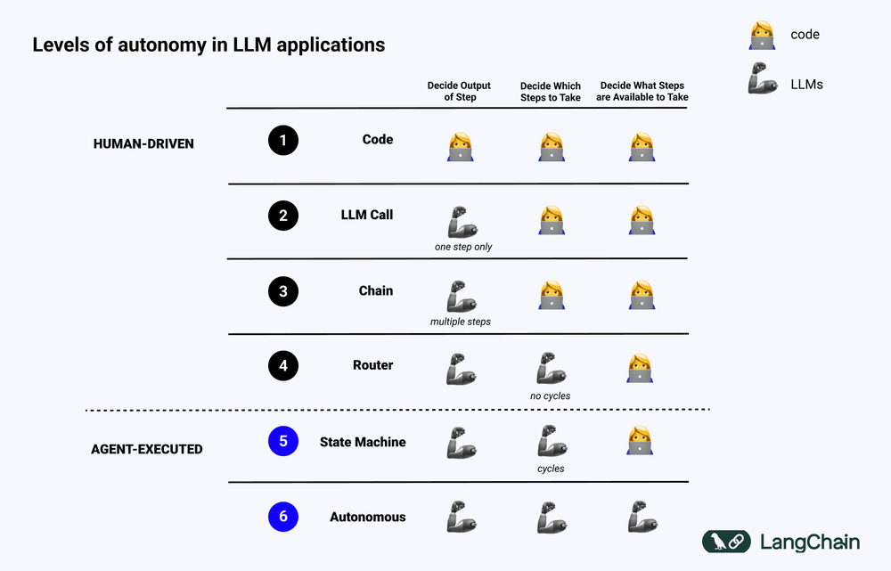

# What is an AI agent?

"에이전트란 무엇인가?" 이 질문은 거의 매일 받습니다. LangChain에서는 개발자가 LLM 애플리케이션을 빌드하는 데 도움이 되는 도구를 구축하며, 특히 논리 엔진으로 작동하고 외부 데이터 및 계산 소스와 상호작용하는 애플리케이션을 만듭니다. 여기에는 일반적으로 "에이전트"라고 불리는 시스템이 포함됩니다. 사람마다 AI 에이전트에 대한 정의가 조금씩 다릅니다. 제 정의는 아마도 대부분보다 더 기술적일 것입니다:

> 💡 AI 에이전트는 애플리케이션의 제어 흐름을 결정하기 위해 LLM을 사용하는 시스템입니다. 
 
여기서도 제 정의가 완벽하지 않다는 것을 인정합니다. 사람들은 종종 에이전트를 고급, 자율적, 인간과 유사하다고 생각합니다. 그러나 LLM이 두 가지 다른 경로 사이를 라우팅하는 간단한 시스템은 어떨까요? 이 시스템은 제 기술적 정의에 부합하지만, 에이전트가 할 수 있는 것에 대한 일반적인 인식에는 맞지 않습니다. 에이전트가 정확히 무엇인지 정의하기가 어렵습니다!

이것이 제가 지난주에 앤드류 응(Andrew Ng)의 트윗을 정말 좋아한 이유입니다. 그는 “어떤 작업이 진정한 AI 에이전트로 포함되거나 제외될지에 대해 논쟁하는 대신, 시스템이 에이전트 역할을 수행할 수 있는 다양한 방법(degree)가 있다”고 제안합니다. 예를 들어 자율 주행차에는 자율성 수준이 있는 것처럼, AI 에이전트의 능력도 스펙트럼으로 볼 수 있습니다. 저는 이 관점에 전적으로 동의하며, 앤드류가 이를 아주 잘 표현했다고 생각합니다. 앞으로 에이전트에 대해 질문을 받으면, 대신 “에이전트 역할”의 의미에 대해 대화의 방향을 돌릴 것입니다.

## What does it mean to be agentic?
제가 작년에 LLM 시스템에 대해 TED 강연을 했는데, 그때 아래 슬라이드를 사용하여 LLM 애플리케이션에서의 다양한 자율성 수준에 대해 이야기했습니다. 

시스템이 LLM을 통해 시스템의 동작 방식을 결정할수록 더 "에이전트적"이라고 할 수 있습니다. 

LLM을 사용하여 특정 다운스트림 워크플로우로 입력을 라우팅하는 것은 약간의 "에이전트적" 행동을 나타냅니다. 이는 위 다이어그램의 라우터 카테고리에 해당합니다. 

여러 LLM을 사용하여 여러 라우팅 단계를 수행한다면, 이는 라우터와 상태 머신 사이에 위치하게 됩니다. 

이러한 단계 중 하나가 계속 진행할지 종료할지를 결정하여 시스템이 완료될 때까지 루프 내에서 실행되도록 허용한다면, 이는 상태 머신에 해당합니다. 

시스템이 도구를 구축하고 이를 기억하며 미래 단계에서 이를 활용한다면, 이는 Voyager 논문에서 구현한 것과 유사하며, 매우 에이전트적이며 높은 자율 에이전트 카테고리에 속합니다. 

이러한 "에이전트적" 정의는 여전히 매우 기술적입니다. 저는 LLM 시스템을 설계하고 설명할 때 유용하다고 생각하기 때문에 더 기술적인 "에이전트적" 정의를 선호합니다.

## Why is "agentic" a helpful concept?

모든 개념과 마찬가지로, 왜 우리가 "에이전트적"이라는 개념이 필요한지 물어볼 가치가 있습니다. 이 개념은 무엇을 도와줄까요?

시스템이 얼마나 에이전트적인지를 이해하면 개발 과정에서 의사 결정을 안내할 수 있습니다. 여기에는 시스템을 구축하고, 실행하며, 상호작용하고, 평가하고, 모니터링하는 것이 포함됩니다. 

시스템이 더 에이전트적일수록, 오케스트레이션 프레임워크가 도움이 될 것입니다. 복잡한 에이전트 시스템을 설계할 때, 이러한 개념을 고려할 수 있는 올바른 추상화를 가진 프레임워크가 있으면 더 빠른 개발이 가능합니다. 이 프레임워크는 분기 로직과 사이클에 대한 일류 지원을 제공해야 합니다.

시스템이 더 에이전트적일수록 실행이 더 어려워집니다. 점점 더 복잡해지고, 일부 작업은 완료하는 데 오랜 시간이 걸릴 것입니다. 이는 백그라운드에서 작업을 실행하고, 중간에 발생하는 오류를 처리하기 위한 내구성 있는 실행이 필요함을 의미합니다.

시스템이 더 에이전트적일수록 실행 중에 시스템과 상호작용하고 싶어질 것입니다. 정확한 단계를 미리 알 수 없기 때문에 내부에서 무엇이 일어나고 있는지 관찰할 수 있는 능력이 필요합니다. 에이전트가 의도된 경로에서 벗어나는 경우, 특정 시점에서 상태나 지시를 수정하여 다시 올바른 경로로 유도할 수 있는 능력이 필요합니다.

시스템이 더 에이전트적일수록 이러한 유형의 애플리케이션을 위해 구축된 평가 프레임워크가 필요합니다. 여러 번 평가를 실행해야 하며, 중간 단계와 최종 결과물 모두를 테스트하여 에이전트가 얼마나 효율적으로 동작하는지 확인해야 합니다.

시스템이 더 에이전트적일수록 새로운 유형의 모니터링 프레임워크가 필요합니다. 에이전트가 수행하는 모든 단계를 자세히 분석하고, 에이전트가 수행하는 단계에 따라 실행을 쿼리할 수 있는 능력이 필요합니다.

시스템의 에이전트적 기능 스펙트럼을 이해하고 활용하면 개발 과정의 효율성과 견고성을 향상시킬 수 있습니다.

## Agentic is new

최근 LLM 열풍에서 실제로 무엇이 새로운지 종종 생각해보게 됩니다. 사람들이 구축하는 LLM 애플리케이션을 위해 새로운 도구와 인프라가 필요할까요? 아니면 이전 LLM 시대의 일반적인 도구와 인프라가 충분할까요? 

제 생각에는, 애플리케이션이 더 에이전트적일수록 새로운 도구와 인프라가 필요합니다. 이것이 바로 LangGraph, 에이전트 구축, 실행 및 상호작용을 돕는 에이전트 오케스트레이터와 LLM 애플리케이션을 위한 테스트 및 관찰 플랫폼인 LangSmith를 구축한 이유입니다. 우리가 에이전트 스펙트럼에서 더 나아갈수록, 지원 도구의 전체 생태계를 재구상해야 합니다.
