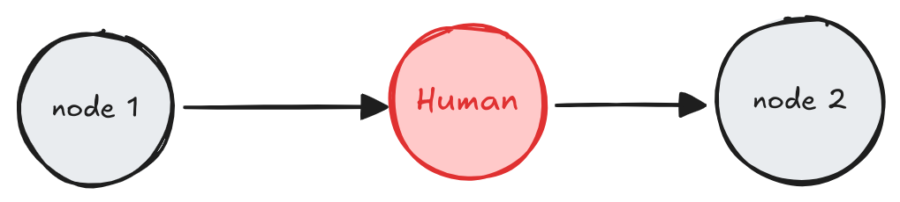

<style>code { white-space: pre; overflow-x: auto; }</style>

[](https://langchain-ai.github.io/langgraph/concepts/human_in_the_loop/)


# Human-in-the-loop

> **이 가이드는 `interrupt` 함수를 사용합니다.**  
> LangGraph 0.2.57부터는 human-in-the-loop 패턴을 단순화하기 위해 [`interrupt` 함수](https://langchain-ai.github.io/langgraph/reference/types/#langgraph.types.interrupt)를 사용하는 것이 권장됩니다. 


Human-in-the-loop(또는 "on-the-loop") 워크플로는 자동화된 프로세스에 사람의 입력을 통합하여 중요한 단계에서 의사결정, 검증 또는 수정이 가능하도록 합니다. 이는 특히 기본 모델이 가끔 부정확한 결과를 생성할 가능성이 있는 LLM 기반 애플리케이션에서 유용합니다. 규제 준수, 의사결정, 콘텐츠 생성과 같이 오류가 낮아야만 하는 시나리오에서는 사람의 개입을 통해 모델 출력물을 검토, 수정 또는 무효화함으로써 신뢰성을 보장할 수 있습니다.

<br>

## Use case
LLM 기반 애플리케이션에서 human-in-the-loop 워크플로의 주요 사용 사례는 다음과 같습니다:

1. 🛠️ 도구 호출 검토: LLM이 제안하는 도구 호출을 실행 전에 사람이 검토, 편집 또는 승인할 수 있습니다. 
2. ✅ LLM 출력 검증: 사람이 LLM이 생성한 콘텐츠를 검토, 편집 또는 승인할 수 있습니다. 
3. 💡 맥락 제공: LLM에게 명확한 설명이나 추가적인 세부 정보 혹은 다중 턴 대화를 지원을 위해 사람의 입력을 활성화 할 수 있습니다.

<br>

## `interrupt`

LangGraph의 `interrupt` 함수는 특정 노드에서 그래프를 일시 중지하고, 사람에게 정보를 제공한 뒤, 입력을 받아 그래프를 다시 실행함으로써 Human-in-the-loop 워크플로를 가능하게 합니다. 이 함수는 승인, 수정, 추가적인 입력과 같은 작업에 유용합니다. `interrupt` 함수는 사람이 제공한 값을 사용해 그래프를 다시 실행할 수 있도록 `Command` 객체와 함께 사용됩니다.

```python
from typing import TypedDict
import uuid

from langgraph.checkpoint.memory import MemorySaver
from langgraph.constants import START
from langgraph.graph import StateGraph
from langgraph.types import interrupt, Command

class State(TypedDict):
   """The graph state."""
   some_text: str

def human_node(state: State):
   value = interrupt(
      # 사람에게 표시할 JSON 직렬화 가능한 모든 값
      # 예를 들어 질문, 텍스트 조각 또는 상태 내의 키 집합
      {
         "text_to_revise": state["some_text"]
      }
   )
   return {
      # 사람의 입력으로 상태를 업데이트하거나 입력을 기반으로 그래프를 라우팅합니다.
      "some_text": value
   }

# Build the graph
graph_builder = StateGraph(State)
# Add the human-node to the graph
graph_builder.add_node("human_node", human_node)
graph_builder.add_edge(START, "human_node")

checkpointer = MemorySaver()
graph = graph_builder.compile(
   checkpointer=checkpointer # `interrupt` 동작을 위해 필요합니다.
)

# 그래프를 실행할 때 스레드 ID를 전달합니다.
thread_config = {"configurable": {"thread_id": uuid.uuid4()}}

# `__interrupt__` 정보를 직접 표시하기 위해 stream() 사용.
for chunk in graph.stream({"some_text": "Original text"}, config=thread_config):
   print(chunk)

# Command를 사용하여 그래프를 재개합니다
for chunk in graph.stream(Command(resume="Edited text"), config=thread_config):
   print(chunk)
```

API Reference: MemorySaver | START | StateGraph | interrupt | Command

```
{'__interrupt__': (
      Interrupt(
         value={'question': 'Please revise the text', 'some_text': 'Original text'}, 
         resumable=True, 
         ns=['human_node:10fe492f-3688-c8c6-0d0a-ec61a43fecd6'], 
         when='during'
      ),
   )
}
{'human_node': {'some_text': 'Edited text'}}
```

> **Warning**  
> 인터럽트는 강력하고 사용하기 쉽지만, 개발 경험 면에서 Python의 `input()` 함수와 유사하게 보일 수 있지만, 인터럽트가 중단 지점에서 자동으로 실행을 재개하지 않는다는 점을 유의해야 합니다. 대신, 인터럽트가 사용된 노드 전체를 다시 실행합니다. 이러한 이유로, 인터럽트는 일반적으로 노드의 시작 부분이나 전용 노드에 배치하는 것이 가장 좋습니다. 자세한 내용은 [인터럽트에서 재개하기 섹션](#how-does-resuming-from-an-interrupt-work)을 읽어보세요.

<br>

## Requirements

그래프에서 interrupt를 사용하려면:

1. 각 단계의 그래프 상태를 저장할 [체크포인터](./persistence.md#checkpoints)를 지정합니다.
2. 적절한 위치에서 interrupt()를 호출합니다. 예시는 [디자인 패턴 섹션](#design-patterns)을 참조하세요.
3. 인터럽트가 발생할 때까지 [스레드 ID](./persistence.md#threads)와 함께 그래프를 실행합니다.
4. `invoke` / `ainvoke` / `stream` / `astream`([`Command` primitive 참조](#the-command-primitive))을 사용하여 실행을 재개합니다.

<br>

## Design Patterns

Human-in-the-loop 워크플로에서 일반적으로 수행할 수 있는 세 가지 주요 작업은 다음과 같습니다:

1. **Approve or Reject**: 중요한 단계(예: API 호출) 전에 그래프를 일시 중지하여 작업을 검토하고 승인합니다. 작업이 거부된 경우, 해당 단계를 실행하지 않도록 막고 대체 작업을 수행할 수 있습니다. 이 패턴은 종종 사람의 입력에 따라 그래프를 라우팅하는 방식으로 구현됩니다.
2. **Edit Graph State**: 그래프를 일시 중지하여 그래프 상태를 검토하고 편집합니다. 이는 실수를 수정하거나 추가 정보를 통해 상태를 업데이트하는 데 유용합니다. 이 패턴은 종종 사람의 입력을 사용해 상태를 업데이트하는 방식으로 구현됩니다.
3. **Get input**: 그래프의 특정 단계에서 명시적으로 사람의 입력을 요청합니다. 이는 에이전트의 의사결정 과정을 지원하기 위해 추가 정보나 맥락을 수집하거나 다중 턴 대화를 지원하는 데 유용합니다.

아래에서는 이러한 작업을 활용해 구현할 수 있는 다양한 디자인 패턴을 보여줍니다.


### Approve or Reject


중요한 단계(API 호출 등) 전에 그래프를 일시 정지하여 작업을 검토하고 승인할 수 있습니다. 작업이 거부되면 그래프가 해당 단계를 실행하지 않도록 막고, 대체 작업을 수행할 수 있습니다. 

```python
from typing import Literal
from langgraph.types import interrupt, Command

def human_approval(state: State) -> Command[Literal["some_node", "another_node"]]:
    is_approved = interrupt(
        {
            "question": "Is this correct?",
            # 사람이 검토하고 승인해야 할 출력을 표시합니다.
            "llm_output": state["llm_output"]
        }
    )

    if is_approved:
        return Command(goto="some_node")
    else:
        return Command(goto="another_node")

# 그래프의 적절한 위치에 노드를 추가하고 관련 노드와 연결합니다.
graph_builder.add_node("human_approval", human_approval)
graph = graph_builder.compile(checkpointer=checkpointer)

# 그래프를 실행하고 중단점에 도달하면 그래프가 일시 정지됩니다.
# 승인 또는 거부로 그래프를 재개합니다.
thread_config = {"configurable": {"thread_id": "some_id"}}
graph.invoke(Command(resume=True), config=thread_config)
```

API Reference: [interrupt](https://langchain-ai.github.io/langgraph/reference/types/#langgraph.types.interrupt) | [Command](https://langchain-ai.github.io/langgraph/reference/types/#langgraph.types.Command)

자세한 예시는 [이 가이드](../how_to/how_to_review_tool_calls.md)를 확인하세요.


### Reveiw & Edit State


사람이 그래프의 상태를 검토하고 편집할 수 있습니다. 이는 실수를 수정하거나 추가 정보를 업데이트하는 데 유용합니다.

```python
from langgraph.types import interrupt

def human_editing(state: State):
    ...
    result = interrupt(
        # 클라이언트에게 표시할 인터럽트 정보.
        # JSON 직렬화할 수 있는 모든 값이 가능합니다.
        {
            "task": "LLM의 출력을 검토하고 필요한 수정을 하세요.",
            "llm_generated_summary": state["llm_generated_summary"]
        }
    )

    # 편집된 텍스트로 상태를 업데이트합니다.
    return {
        "llm_generated_summary": result["edited_text"]
    }

# 적절한 위치에 노드를 추가하고 관련 노드와 연결합니다.
graph_builder.add_node("human_editing", human_editing)
graph = graph_builder.compile(checkpointer=checkpointer)

...

# 그래프를 실행하고 중단점에 도달하면 그래프가 일시 정지됩니다.
# 편집된 텍스트로 그래프를 재개합니다.
thread_config = {"configurable": {"thread_id": "some_id"}}
graph.invoke(
    Command(resume={"edited_text": "The edited text"}),
    config=thread_config
)
```

API Reference: [interrupt](https://langchain-ai.github.io/langgraph/reference/types/#langgraph.types.interrupt)

자세한 예시는 [이 가이드](../how_to/how_to_wait_for_user_input_using_interrupt.md)를 확인하세요.


### Review Tool Calls


사람이 LLM(대규모 언어 모델)의 응답 결과를 진행하기 전에 검토하고 편집할 수 있습니다. 이는 LLM에 의해 선택되어진 도구가 민감하거나 사람의 감독이 필요한 경우 특히 중요합니다.

```python
def human_review_node(state) -> Command[Literal["call_llm", "run_tool"]]:
    # Command(resume=<human_review>)를 통해 제공할 값입니다.
    human_review = interrupt(
        {
            "question": "Is this correct?",
            # 도구 호출을 검토합니다.
            "tool_call": tool_call
        }
    )

    review_action, review_data = human_review

    # 도구 호출을 승인하고 계속 진행합니다.
    if review_action == "continue":
        return Command(goto="run_tool")

    # 도구 호출을 수동으로 수정한 후 계속 진행합니다.
    elif review_action == "update":
        ...
        updated_msg = get_updated_msg(review_data)
        # 기존 메시지를 수정하려면 일치하는 ID와 함께 메시지를 전달해야 합니다.
        return Command(goto="run_tool", update={"messages": [updated_message]})

    # 자연어 피드백을 제공한 다음 에이전트에게 반환합니다.
    elif review_action == "feedback":
        ...
        feedback_msg = get_feedback_msg(review_data)
        return Command(goto="call_llm", update={"messages": [feedback_msg]})
```

자세한 예시는 [이 가이드](../how_to/how_to_review_tool_calls.md)를 확인하세요.


### Multi-turn conversation

  
다중 턴 대화 아키텍처에서는 에이전트와 사람이 서로 주고받으며 대화를 이어갑니다. 에이전트는 대화를 다른 에이전트나 시스템의 다른 부분에 넘길 때까지 계속해서 사람과 상호작용할 수 있습니다. 이를 통해 에이전트는 대화형으로 사람으로부터 추가 정보를 수집할 수 있습니다.

이 디자인 패턴은 [여러 에이전트](./multi_agent_systems.md)로 구성된 LLM(대규모 언어 모델) 응용 프로그램에서 유용합니다. 하나 이상의 에이전트가 사람과 다중 턴 대화를 수행해야 할 수 있으며, 이 과정에서 사람은 대화의 여러 단계에서 입력이나 피드백을 제공합니다. 간단히 설명하기 위해, 아래의 에이전트 구현은 단일 노드로 나타내지만 실제로는 여러 노드로 구성된 더 큰 그래프의 일부일 수 있으며 조건부 엣지를 포함할 수 있습니다.

**Using a human node per agent**  
이 패턴에서는 각 에이전트가 사용자로 부터 입력받기 위한 고유한 입력 노드를 가집니다. 이를 위해 노드에 고유한 이름을 지정하거나 (예: "agent 1을 위한 사람", "agent 2를 위한 사람") 하위 그래프에 입력 노드와 에이전트 노드를 포함하여 사용할 수 있습니다.

```python
from langgraph.types import interrupt

def human_input(state: State):
    human_message = interrupt("human_input")
    return {
        "messages": [
            {
                "role": "human",
                "content": human_message
            }
        ]
    }

def agent(state: State):
    # 에이전트 로직
    ...

graph_builder.add_node("human_input", human_input)
graph_builder.add_edge("human_input", "agent")
graph = graph_builder.compile(checkpointer=checkpointer)

# 그래프를 실행하고 중단점에 도달하면 그래프가 일시 정지됩니다.
# 사람의 입력으로 그래프를 재개합니다.
graph.invoke(
    Command(resume="hello!"),
    config=thread_config
)
```
API Reference: [interrupt](https://langchain-ai.github.io/langgraph/reference/types/#langgraph.types.interrupt)

**Sharing human node across multiple agents**  
이 패턴에서는 단일 입력 노드를 사용하여 여러 에이전트의 입력을 받습니다. 활성화 되는 에이전트는 상태값(State)으로 결정되며, 사람의 입력을 받은 후 그래프는 올바른 에이전트로 경로를 설정할 수 있습니다.

```python
from langgraph.types import interrupt

def human_node(state: MessagesState) -> Command[Literal["agent_1", "agent_2", ...]]:
    """사용자 입력을 받기 위한 노드입니다."""
    user_input = interrupt(value="사용자 입력을 받을 준비가 되었습니다.")

    # 상태값으로 활성 에이전트를 결정하여 입력 받은 후 올바른 에이전트로 경로를 설정합니다.
    # 예를 들어, 상태에 필드를 추가하거나 마지막 활성 에이전트를 사용합니다.
    # 또는 에이전트가 생성한 AI 메시지의 `name` 속성을 채웁니다.
    active_agent = ...

    return Command(
        update={
            "messages": [
                {
                    "role": "human",
                    "content": user_input,
                }
            ]
        },
        goto=active_agent,
    )
```
API Reference: [interrupt](https://langchain-ai.github.io/langgraph/reference/types/#langgraph.types.interrupt)

자세한 예시는 [이 가이드](../how_to/how_to_add_multi_turn_conversation_in_a_multi_agent_application.md.md)를 확인하세요.


### Validating human input

그래프 내에서 사람의 입력을 검증해야 하는 경우(클라이언트 측이 아닌), 단일 노드 내에서 여러 번의 인터럽트 호출을 사용하여 이를 달성할 수 있습니다.

```python
from langgraph.types import interrupt

def human_node(state: State):
    """검증을 위한 인간 노드입니다."""
    question = "나이가 어떻게 되시나요?"

    while True:
        answer = interrupt(question)

        # 답변을 검증하고, 유효하지 않으면 다시 입력을 요청합니다.
        if not isinstance(answer, int) or answer < 0:
            question = f"'{answer}'는 유효한 나이가 아닙니다. 나이가 어떻게 되시나요?"
            answer = None
            continue
        else:
            # 답변이 유효하면 진행할 수 있습니다.
            break

    print(f"루프 내의 인간의 나이는 {answer}세 입니다.")
    return {
        "age": answer
    }
```

API Reference: [interrupt](https://langchain-ai.github.io/langgraph/reference/types/#langgraph.types.interrupt)

<br>

## The `Command` primitive

interrupt 함수를 사용할 때, 그래프는 interrupt에서 일시 정지하고 사용자 입력을 기다립니다.

그래프 실행은 invoke, ainvoke, stream 또는 astream 메서드를 통해 전달할 수 있는 [Command](https://langchain-ai.github.io/langgraph/reference/types/#langgraph.types.Command) 함수를 사용하여 다시 시작할 수 있습니다.

`Command` 함수는 재개 과정에서 그래프의 상태를 제어하고 수정할 수 있는 몇 가지 옵션을 제공합니다:

1. **Pass a value to the `interrupt`**: 사용자의 응답 같은 데이터를 `Command(resume=value)`를 사용하여 그래프에 전달할 수 있습니다. 그래프는 `interrupt`가 사용된 노드의 시작 부분에서 다시 시작되며, 이번에는 `interrupt(...)` 호출이 그래프를 일시 정지하는 대신 `Command(resume=value)`의 전달된 값을 반환합니다.
   
   ```python
   # 사용자의 입력으로 그래프 실행을 재개합니다.
   graph.invoke(Command(resume={"age": "25"}), thread_config)
   ```

2. **Update the graph state**: `Command(update=update)`를 사용하여 그래프 상태를 수정할 수 있습니다. 재개는 `interrupt`가 사용된 노드의 시작부터 다시 시작됩니다. `interrupt`가 사용된 노드의 시작 부분에서 실행이 재개되지만, 업데이트된 상태로 재실행됩니다.

   ```python
   # 그래프 상태를 업데이트하고 재개합니다.
   # `interrupt`를 사용하는 경우 `resume` 값을 제공해야 합니다.
   graph.invoke(Command(update={"foo": "bar"}, resume="Let's go!!!"), thread_config)
   ```

`Command`를 활용하여 그래프 실행을 재개하고, 사용자 입력을 처리하며, 그래프의 상태를 동적으로 변경할 수 있습니다.

<br>

## Using with `invoke` and `ainvoke`

`stream` 또는 `astream`을 사용하여 그래프를 실행할 때는 `interrupt`가 실행되었음을 알려주는 `Interrupt` 이벤트를 받게 됩니다.

하지만, `invoke` 및 `ainvoke`는 interrupt 정보를 반환하지 않습니다. 정보를 얻기위해선 `invoke` 또는 `ainvoke` 호출 후 [`get_state`](https://langchain-ai.github.io/langgraph/reference/graphs/#langgraph.graph.graph.CompiledGraph.get_state) 메서드를 사용하여 그래프 상태를 검색해야 합니다.

```python
# 그래프를 interrupt 지점까지 실행합니다.
result = graph.invoke(inputs, thread_config)
# interrupt 정보를 얻기 위해 그래프 상태를 가져옵니다.
state = graph.get_state(thread_config)
# 상태 값을 출력합니다.
print(state.values)
# 대기 중인 작업을 출력합니다.
print(state.tasks)
# 사용자의 입력으로 그래프 실행을 재개합니다.
graph.invoke(Command(resume={"age": "25"}), thread_config)
```
```
{'foo': 'bar'} # 상태 값
(
    PregelTask(
        id='5d8ffc92-8011-0c9b-8b59-9d3545b7e553', 
        name='node_foo', 
        path=('__pregel_pull', 'node_foo'), 
        error=None, 
        interrupts=(Interrupt(value='value_in_interrupt', resumable=True, ns=['node_foo:5d8ffc92-8011-0c9b-8b59-9d3545b7e553'], when='during'),), state=None, 
        result=None
    ),
) # 대기 중인 작업. interrupt
```

<br>

## How does resuming from an interrupt work?

> **Warning**  
> `interrupt`의 재개는 Python의 `input()` 함수와는 다릅니다. `input()` 함수는 호출된 지점에서 정확히 다시 시작하지만, `interrupt`는 그래프 노드의 시작 부분부터 재실행됩니다.

`interrupt` 사용시 재개 작업이 어떻게 작동하는지를 이해하는 것은 매우 중요합니다. `interrupt` 후에 실행을 재개하면 그래프 실행은 마지막 `interrupt`가 발생한 그래프 노드의 **시작 부분**에서 재시작됩니다.

노드의 시작 부분에서 `interrupt`까지 모든 코드는 재실행됩니다.

```python
counter = 0
def node(state: State):
    # 그래프가 재개될 때 노드의 시작부터 interrupt까지의 모든 코드가 다시 실행됩니다.
    global counter
    counter += 1
    print(f"> 노드에 진입: {counter}번")
    # 그래프를 일시 정지하고 사용자 입력을 기다립니다.
    answer = interrupt()
    print("카운터 값은:", counter)
    ...
```

그래프가 재개되면 카운터는 두 번 증가하게 되며, 다음과 같은 출력이 나타납니다:

```plaintext
> 노드에 진입: 2번
카운터 값은: 2
```

<br>

## Common Pitfalls


### Side-effects
노드가 재개될 때마다 재실행되기 때문에 API 호출과 같은 코드는 interrupt 이후에 배치하여 반복실행을 피해야 합니다.

**Side effects before interrupt (BAD)**  
이 코드는 `interrupt`에서 노드가 재개될 때 다시 API 호출을 실행합니다. 
만약 API 호출이 멱등성이 없거나 비용이 많이 드는 경우 문제가 될 수 있습니다.

```python
from langgraph.types import interrupt

def human_node(state: State):
    """검증을 위한 인간 노드입니다."""
    api_call(...) # 이 코드는 노드가 재개될 때 다시 실행됩니다.
    answer = interrupt(question)
```

**Side effects after intterupt (OK)**
```python
from langgraph.types import interrupt

def human_node(state: State):
    """Human node with validation."""

    answer = interrupt(question)

    api_call(answer) # OK as it's after the interrupt
```

**Side effects in a separate node (OK)**
```python
from langgraph.types import interrupt

def human_node(state: State):
    """Human node with validation."""

    answer = interrupt(question)

    return {
        "answer": answer
    }

def api_call_node(state: State):
    api_call(...) # OK as it's in a separate node
```


### Subgraphs called as functions

하위 그래프를 [함수로 호출](./langgraph_glossary.md#as-a-function)할 때, **부모 그래프는 하위 그래프가 호출된 노드의 시작 부분(그리고 interrupt가 트리거된 위치)에서 실행을 재개합니다. 마찬가지로, 하위 그래프도 interrupt 함수가 호출된 노드의 시작 부분에서 실행을 재개**합니다.

예를 들어, 부모 그래프에 3개의 노드가 있다고 가정해봅시다:

- 부모 그래프: `node_1 → node_2 (하위 그래프 호출) → node_3`

하위 그래프는 3개의 노드가 있으며, 두 번째 노드에 interrupt가 포함되어 있다고 가정합니다:

- 하위 그래프: `sub_node_1 → sub_node_2 (interrupt) → sub_node_3`

그래프를 재개하면 다음과 같은 순서로 실행됩니다.

1. 부모 그래프의 `node_1`은 건너뜁니다(이미 실행되었고, 그래프 상태가 스냅샷으로 저장되었습니다).
2. 부모 그래프의 `node_2`를 처음부터 다시 실행합니다.
3. 하위 그래프의 `sub_node_1`은 건너뜁니다 (이미 실행되었고, 그래프 상태가 스냅샷으로 저장되었습니다).
4. 하위 그래프의 `sub_node_2`를 처음부터 다시 실행합니다.
5. `sub_node_3`과 그 이후의 노드를 계속 실행합니다.

다음은 `interrupt`와 함께 하위 그래프가 어떻게 작동하는지 이해하는 데 사용할 수 있는 간단한 예시 코드입니다. 각 노드에 진입한 횟수를 세고 그 횟수를 출력합니다.

```python
import uuid
from typing import TypedDict
from langgraph.graph import StateGraph
from langgraph.constants import START
from langgraph.types import interrupt, Command
from langgraph.checkpoint.memory import MemorySaver

class State(TypedDict):
    """그래프 상태"""
    state_counter: int

counter_node_in_subgraph = 0

def node_in_subgraph(state: State):
    """하위 그래프 내의 노드"""
    global counter_node_in_subgraph
    counter_node_in_subgraph += 1
    # 이 코드는 다시 실행되지 않습니다!
    print(f"`node_in_subgraph`에 총 {counter_node_in_subgraph}번 진입했습니다.")

counter_human_node = 0

def human_node(state: State):
    global counter_human_node
    counter_human_node += 1
    # 이 코드는 다시 실행됩니다!
    print(f"`human_node`에 총 {counter_human_node}번 진입했습니다.")
    answer = interrupt("이름이 무엇인가요?")
    print(f"받은 답변은 {answer} 입니다.")

checkpointer = MemorySaver()
subgraph_builder = StateGraph(State)
subgraph_builder.add_node("some_node", node_in_subgraph)
subgraph_builder.add_node("human_node", human_node)
subgraph_builder.add_edge(START, "some_node")
subgraph_builder.add_edge("some_node", "human_node")
subgraph = subgraph_builder.compile(checkpointer=checkpointer)

counter_parent_node = 0

def parent_node(state: State):
    """이 부모 노드는 하위 그래프를 호출합니다."""
    global counter_parent_node
    counter_parent_node += 1
    # 이 코드는 재개 시 다시 실행됩니다!
    print(f"`parent_node`에 총 {counter_parent_node}번 진입했습니다.")
    # 데모 목적으로 그래프 상태의 키를 증가시킵니다.
    subgraph_state = subgraph.invoke(state)
    return subgraph_state

builder = StateGraph(State)
builder.add_node("parent_node", parent_node)
builder.add_edge(START, "parent_node")
# interrupt가 작동하려면 체크포인터가 필요합니다!
checkpointer = MemorySaver()
graph = builder.compile(checkpointer=checkpointer)

config = {
    "configurable": {
        "thread_id": uuid.uuid4(),
    }
}

for chunk in graph.stream({"state_counter": 1}, config):
    print(chunk)
print('--- 재개 ---')

for chunk in graph.stream(Command(resume="35"), config):
    print(chunk)
```

이 코드는 다음과 같이 출력됩니다:

```plaintext
--- 첫 번째 호출 ---
상위 노드에서: {'foo': 'bar'}
`parent_node`에 총 1번 진입했습니다.
`node_in_subgraph`에 총 1번 진입했습니다.
`human_node`에 총 1번 진입했습니다.
{'__interrupt__': (Interrupt(value='이름이 무엇인가요?', resumable=True, ns=['parent_node:0b23d72f-aaba-0329-1a59-ca4f3c8bad3b', 'human_node:25df717c-cb80-57b0-7410-44e20aac8f3c'], when='during'),)}

--- 재개 ---
상위 노드에서: {'foo': 'bar'}
`parent_node`에 총 2번 진입했습니다.
`human_node`에 총 2번 진입했습니다. 
받은 답변은 35 입니다.
{'parent_node': None}
```


### Using mulitple interrupts

하나의 노드 내에서 여러 Interrupt를 사용하는 것은 [사용자 입력을 검증하는 패턴](#validating-human-input)과 같은 경우에 유용할 수 있습니다. 하지만, 동일한 노드에서 여러 Interrupt를 사용할 때는 신중히 다루지 않으면 예기치 않은 동작이 발생할 수 있습니다.

노드에 여러 Interrupt 호출이 포함된 경우, LangGraph는 해당 노드를 실행하는 작업(task)에 특정한 재개 값(resume values)의 목록을 유지합니다. 실행이 재개될 때마다 항상 노드의 시작 지점에서 실행이 시작됩니다. 각 Interrupt 호출 시, LangGraph는 작업의 재개 목록에서 일치하는 값을 확인합니다. 이 일치는 엄격하게 **인덱스 기반(index-based)** 으로 이루어지므로, 노드 내에서 Interrupt 호출의 순서가 매우 중요합니다.

문제를 방지하려면 실행 사이에 노드의 구조를 동적으로 변경하거나 Interrupt 호출을 추가, 제거 또는 재배열하는 작업을 하지 말아야 합니다. 이러한 변경은 인덱스 불일치를 초래할 수 있습니다.  
이와 같은 문제는 일반적으로 다음과 같은 비정상적인 패턴에서 발생합니다:
- `Command(resume=..., update=SOME_STATE_MUTATION)`을 통해 상태를 변경하는 경우  
- 전역 변수를 사용하여 노드 구조를 동적으로 수정하는 경우  

