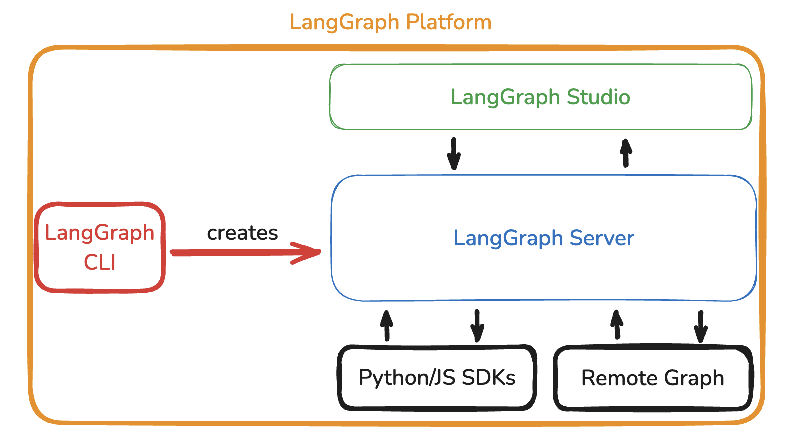

# LangGraph Platform

 

## Overview

LangGraph Platform은 오픈 소스 LangGraph 프레임워크를 기반으로 구축된, production 환경에서 에이전트 애플리케이션을 배포하기 위한 상업적 솔루션입니다.

LangGraph Platform은 LangGraph 애플리케이션의 개발, 배포, 디버깅 및 모니터링을 지원하기 위해 함께 작동하는 여러 구성 요소로 구성됩니다:

- [LangGraph Server](./langgraph_server.md): 서버는 에이전트 애플리케이션을 배포하기 위해 명확한 API와 아키텍처를 제공합니다. 이를 통해 서버 인프라 개발에 신경 쓰지 않고 에이전트 로직 구현에 집중할 수 있습니다.
- [LangGraph Studio](./langgraph_studio.md): LangGraph 스튜디오는 LangGraph 서버에 연결하여 애플리케이션을 로컬에서 시각화, 상호작용 및 디버깅할 수 있는 특수화된 IDE입니다.
- [LangGraph CLI](./langgraph_cli.md): LangGraph CLI는 로컬 LangGraph와 상호작용하는 데 도움이 되는 command-line 인터페이스입니다.
- [Python/JS SDK](./langgraph_sdk.md): Python/JS SDK는 배포된 LangGraph 애플리케이션과 프로그래밍 방식으로 상호작용할 수 있는 방법을 제공합니다.
- [Remote Graph](../how_to/how_to_interact_with_the_deployment_using_remotegraph.md): 원격 그래프(Remote Graph)를 사용하면 로컬에서 실행되는 것처럼 배포된 LangGraph 애플리케이션과 상호작용할 수 있습니다.

LangGraph Platform은 배포 옵션 가이드에서 설명된 몇 가지 다른 배포 옵션을 제공합니다.

 

## Why Use LangGraph Platform?

LangGraph Platform은 LLM 애플리케이션을 프로덕션으로 배포할 때 발생하는 일반적인 문제를 처리하여 서버 인프라를 관리하는 대신 에이전트 로직에 집중할 수 있게 합니다.

- [Streaming Support](./streaming.md): 에이전트가 더욱 정교해짐에 따라 토큰 출력과 중간 상태를 사용자에게 스트리밍하는 것이 좋습니다. 그렇지 않다면, 사용자는 어떠한 피드백 없이 긴 작업을 기다려야 합니다. LangGraph Server는 다양한 애플리케이션 요구에 최적화된 여러 스트리밍 모드를 제공합니다.
- **Background Runs**: 처리 시간이 긴 에이전트의 경우(예: 몇 시간), 연결을 유지하는 것이 비실용적일 수 있습니다. LangGraph Server는 백그라운드에서 에이전트 실행을 지원하며 실행 상태를 효과적으로 모니터링하기 위해 폴링 엔드포인트와 웹훅을 모두 제공합니다.
- **Support for long runs**: 기본 서버 설정은 오래걸리는 요청을 처리할 때 종종 타임아웃이나 중단 문제를 겪습니다. LangGraph Server의 API는 정기적인 하트비트 신호를 보내 처리 시간동안 예상치 못한 연결 종료를 방지합니다.
- **Handling Burstiness**: 특히 실시간 사용자 상호작용이 있는 애플리케이션에서는 많은 요청이 동시에 서버에 몰리는 "bursty" 현상을 경험할 수 있습니다. LangGraph Server는 작업 큐를 포함하여 많은 로드에도 요청이 손실 없이 일관되게 처리합니다.
- [Double Texting](./double_texting.md): 애플리케이션에서는 사용자가 여러 메시지를 빠르게 보낼 수 있는 경우가 많습니다. 이러한 "double texting"이 적절히 처리되지 않으면 에이전트 흐름을 방해할 수 있습니다. LangGraph Server는 이 같은 상호작용을 처리하고 관리하는 전략을 제공합니다.
- **Checkpointers and Memory Management**: 영속성이 필요한 에이전트의 경우(예: 대화 메모리), 견고한 저장 솔루션을 배포하는 것이 복잡할 수 있습니다. LangGraph Platform은 최적화된 [checkpointers](./persistence.md#checkpoints)와 [memory store](./persistence.md#memory-store)를 포함하여 추가 노력없이 세션 간 상태를 관리합니다.
- [Human-in-the-loop Support](./human_in_the_loop.md): 많은 애플리케이션에서는 사용자가 에이전트 프로세스에 개입할 방법을 필요로 합니다. LangGraph Server는 human-in-the-loop 시나리오를 위한 특수 엔드포인트를 제공하여 에이전트 워크플로우에 수동적인 감독 과정을 쉽게 통합할 수 있게 합니다.

LangGraph Platform을 사용하면 이러한 문제를 완화하는 견고하고 확장 가능한 배포 솔루션에 액세스할 수 있으며, 이를 수동으로 구현하고 유지 관리하는 노력을 절약할 수 있습니다. 이를 통해 배포 인프라 문제를 해결하는 대신 효과적인 에이전트 행동을 구축하는 데 집중할 수 있습니다.

