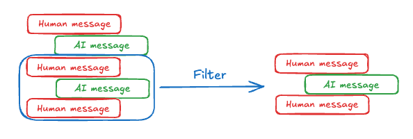

[](https://langchain-ai.github.io/langgraph/concepts/memory/)


# Memory


## What is Memory?

[메모리](../asset/cognitive_neuroscience_perspective_on_memory.pdf)는 사람들이 정보를 저장, 검색 및 활용하여 현재와 미래를 이해할 수 있게 하는 인지(congitive) 기능입니다. 예를 들어, 매번 동일한 내용을 반복해서 말해야 하는 동료와 함께 일하는 좌절감을 상상해 보세요! AI 에이전트가 수많은 사용자 상호작용을 포함한 더 복잡한 작업을 수행함에 따라, 메모리 기능을 가지는 것은 효율성과 사용자 만족도를 위해 매우 중요합니다. 메모리를 통해 에이전트는 피드백을 학습하고 사용자의 선호도를 적용할 수 있습니다. 이 가이드에서는 기억 범위에 따라 두 가지 유형의 메모리를 다룹니다:

**단기 메모리(Short-term memory)**, 또는 스레드 범위 메모리(thread-scoped memory)는 사용자와의 단일 대화 스레드 내에서 언제든지 호출할 수 있습니다. LangGraph는 에이전트 [상태(state)](./langgraph_glossary.md#state)의 일부분으로 단기 메모리를 관리합니다. 상태는 [체크포인터](./persistence.md#checkpoints)를 사용하여 데이터베이스에 영속되기 때문에 언제든지 스레드를 다시 시작할 수 있습니다. 단기 메모리는 그래프가 호출되거나 단계가 완료될 때 업데이트되며, 각 단계의 시작 시 상태가 읽혀집니다.

**장기 메모리(Long-term memory)** 는 대화 스레드 **전체**에 걸쳐 공유됩니다. 이는 언제든지, **어떤 스레드**에서든 호출할 수 있습니다. 메모리는 단일 스레드 ID 범위에 속해질 뿐만 아니라 사용자 정의 네임스페이스 범위 내에도 속해집니다. LangGraph는 장기 메모리를 저장하고 호출할 수 있는 [저장소](./persistence.md#memory-store)를 제공합니다.

두 가지 유형의 메모리는 모두 애플리케이션을 이해하고 구현하는 데 중요합니다.


## Short-term memory

단기 메모리는 애플리케이션이 단일 스레드 또는 대화 내에서 이전의 상호작용을 기억할 수 있게 합니다. 이메일이 단일 대화에서 메시지를 그룹화하는 것과 유사하게 스레드는 세션에서 여러 상호작용을 구성합니다.

LangGraph는 에이전트 상태의 일부로써 단기 메모리를 관리하며, 이는 스레드 범위의 체크포인트를 통해 저장됩니다. 이 상태(state)에는 일반적으로 대화 기록과 업로드된 파일, 검색된 문서 또는 생성된 아티팩트와 같은 다른 상태 데이터가 포함될 수 있습니다. 이를 그래프 상태에 저장함으로써 봇은 다른 스레드와 분리된 상태에서 주어진 대화의 전체 컨텍스트를 접근할 수 있습니다.

대화 기록이 단기 메모리를 나타내는 가장 일반적인 형태이므로, 다음 섹션에서는 메시지 목록이 길어질 때 대화 기록을 관리하는 기술에 대해 다룹니다. 높은 수준의 개념에 집중하고 싶다면,  장기 메모리을 참고하세요.


### Managing long conversation history

긴 대화는 오늘날의 LLM에게 도전 과제입니다. 전체 기록이 LLM의 context window에 전부 들어갈 수 없기에  복구 불가능한 오류가 발생할 수 있습니다. 설령 LLM 이 기술적으로 전체 컨텍스트 길이를 지원하더라도, 대부분의 LLM은 긴 컨텍스트에서 성능이 저하됩니다. 오래된 내용이나 주제와 벗어난 콘텐츠에 의해 "산만해지고(distracted)", 응답 시간이 느려지고 비용이 증가하는 문제가 발생합니다.

단기 메모리를 관리하는 것은 애플리케이션의 다른 성능 요구사항(지연 시간 및 비용)과 [정밀도와 재현율(precision & recall)](https://en.wikipedia.org/wiki/Precision_and_recall#:~:text=Precision%20can%20be%20seen%20as,irrelevant%20ones%20are%20also%20returned)의 균형을 맞추는 작업입니다. 항상 그렇듯이, LLM을 위해 정보를 어떻게 표현할지 비판적으로 고민하고 데이터를 검토하는 것이 중요합니다. 아래에서는 메시지 목록을 관리하기 위한 몇 가지 일반적인 기법을 다루며, 여러분의 애플리케이션에 가장 적합한 절충안을 선택할 수 있도록 충분한 맥락을 제공하고자 합니다.

- [Editing message lists](#editing-message-lists): 언어 모델에 전달하기 전에 메시지 목록을 다듬고 필터링하는 방법에 대해 생각합니다.
- [Summarizing past conversations](#summarizing-past-conversations): 메시지 목록을 필터링하는 것 외에 자주 사용하는 기술입니다.


### Editing message lists

Chat model 은 개발자 명령(시스템 메시지)과 사용자 입력(사용자 메시지)을 포함하는 메시지를 컨텍스트로 받습니다. 채팅 애플리케이션에서는 메시지가 사용자 입력과 모델 응답 간에 교대로 전송되어 시간이 지남에 따라 메시지 목록이 길어집니다. 컨텍스트 윈도우는 제한적이며, 토큰이 많은 메시지 목록은 비용이 많이 들기 때문에, 많은 애플리케아이션이 오래된 정보를 수동으로 제거하거나 버림는 것이 유리할 수 있습니다.



가장 직접적인 방식은 목록에서 오래된 메시지를 제거하는 것입니다([가장 최근에 사용되지 않은 캐시처럼](https://en.wikipedia.org/wiki/Page_replacement_algorithm#Least_recently_used)).

LangGraph에서 목록 내의 콘텐츠를 삭제하는 일반적인 방법은 특정 노드에서 목록의 일부를 삭제하게끔 업데이트를 반환하는 것입니다. 이 업데이트의 형식은 사용자가 정의할 수 있지만, 일반적으로 객체나 딕셔너리를 반환하여 유지할 값을 지정하는 방식이 많이 사용됩니다.

```python
def manage_list(existing: list, updates: Union[list, dict]):
    if isinstance(updates, list):
        # 일반적인 경우, 기록에 추가
        return existing + updates
    elif isinstance(updates, dict) and updates["type"] == "keep":
        # 어떻게 생겼는지를 결정할 수 있습니다.
        # 예를 들어, "DELETE" 문자열을 수락하고 전체 목록을 삭제할 수 있습니다.
        return existing[updates["from"]:updates["to"]]
    # 업데이트 해석 방법을 정의합니다.

class State(TypedDict):
    my_list: Annotated[list, manage_list]

def my_node(state: State):
    return {
        # "my_list" 필드에 대해 목록 끝에서 -5 인덱스부터 끝까지의 값만 유지하도록 업데이트 반환
        "my_list": {"type": "keep", "from": -5, "to": None}
    }
```

LangGraph는 `my_list` 키로 업데이트가 반환될 때마다 `manage_list` "리듀서" 함수를 호출합니다. 해당 함수 내에서 어떤 유형의 업데이트를 수락할지 정의합니다. 일반적으로 메시지는 기존 목록에 추가됩니다(대화는 계속 성장합니다); 그러나 상태의 특정 부분을 "유지"할 수 있도록 딕셔너리를 수락하는 기능도 추가했습니다. 이를 통해 오래된 메시지 컨텍스트를 프로그래밍 방식으로 삭제할 수 있습니다.

또 다른 일반적인 접근 방식은 삭제할 모든 메시지의 ID를 지정하는 "제거" 객체 목록을 반환하는 것입니다. LangChain 메시지와 add_messages 리듀서(또는 동일한 기본 기능을 사용하는 MessagesState)를 사용하는 경우 RemoveMessage를 사용하여 이를 수행할 수 있습니다.

```python
from langchain_core.messages import RemoveMessage, AIMessage
from langgraph.graph import add_messages

# ... 다른 import

class State(TypedDict):
    # add_messages는 기본적으로 기존 목록에 ID로 메시지를 삽입합니다.
    # RemoveMessage가 반환되면, 해당 ID로 메시지를 목록에서 삭제합니다.
    messages: Annotated[list, add_messages]

def my_node_1(state: State):
    # 상태의 `messages` 목록에 AI 메시지 추가
    return {"messages": [AIMessage(content="Hi")]}

def my_node_2(state: State):
    # 상태의 `messages` 목록에서 마지막 2개의 메시지를 제외한 모든 메시지 삭제
    delete_messages = [RemoveMessage(id=m.id) for m in state['messages'][:-2]]
    return {"messages": delete_messages}
```

위의 예에서, add_messages 리듀서는 my_node_1에서 보여준 대로 메시지 상태 키에 새 메시지를 추가할 수 있게 합니다. RemoveMessage를 보면 해당 ID의 메시지를 목록에서 삭제합니다(그리고 RemoveMessage는 폐기됩니다). LangChain 특정 메시지 처리에 대한 자세한 내용은 RemoveMessage 사용 방법에 대한 [이 how-to](https://langchain-ai.github.io/langgraph/how-to-guides/)를 참조하세요.

추가적인 정보가 필요하면 언제든지 말씀해 주세요! 😊

[출처](https://langchain-ai.github.io/langgraph/concepts/memory/#editing-message-lists)


### Summarizing past conversations