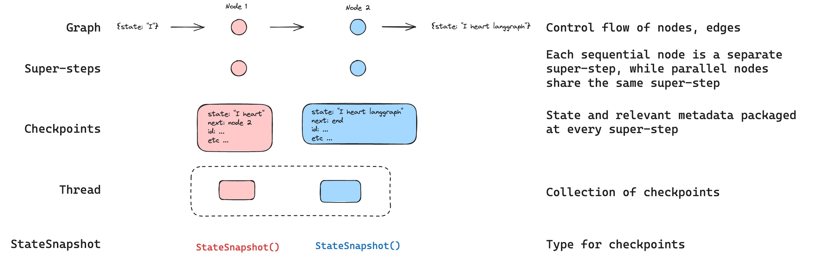

<style>code { white-space: pre; overflow-x: auto; }</style>

[](https://langchain-ai.github.io/langgraph/concepts/persistence/)


# Persistence

LangGraph는 체크포인터를 통해 구현된 내장 지속성 레이어를 가지고 있습니다. 그래프를 체크포인터로 컴파일하면, 체크포인터가 매 슈퍼 스텝마다 그래프 상태의 체크포인트를 저장합니다. 이러한 체크포인트는 스레드에 저장되며, 그래프 실행 후에도 접근할 수 있습니다. 스레드를 통해 실행 후의 그래프 상태에 접근할 수 있기 때문에, 인간이 개입하는 기능, 메모리, 시간 여행, 장애 내성 등 여러 강력한 기능을 사용할 수 있습니다. 

전체 예제를 보려면, 이 [사용 가이드](../how_to/how_to_add_thread_level_persistence_to_your_graph.md)를 참조하세요. 아래에서는 이러한 개념 각각을 자세히 설명합니다.




## Threads

스레드는 체크포인터가 저장한 각 체크포인트에 할당된 고유 ID 또는 스레드 식별자입니다. 그래프를 체크포인터와 함께 호출할 때, `configurable` 에  `thread_id`를 지정해야 합니다: 
```json
{
    "configurable": {
        "thread_id": "1"
    }
}
```


## Checkpoints

체크포인트는 각 슈퍼 스텝에서 저장된 그래프 상태의 스냅샷이며, 다음과 같은 주요 속성을 가진 `StateSnapshot` 객체로 표현됩니다:
- `config`: 이 체크포인트와 관련된 구성.
- `metadata`: 이 체크포인트와 관련된 메타데이터.
- `values`: 이 시점의 상태 채널 값.
- `next`: 그래프에서 다음에 실행할 노드 이름의 튜플.
- `tasks`: 다음에 실행할 작업에 대한 정보를 포함하는 `PregelTask` 객체의 튜플. 이전에 시도된 스텝이라면 오류 정보가 포함됩니다. 만약 그래프가 노드 내에서 [동적](../how_to/how_to_add_dynamic_breakpoints_with_nodeinterrupt.md)으로 중단되었다면, `tasks`에는 중단과 관련된 추가 데이터가 포함됩니다.

간단한 그래프를 다음과 같이 호출할 때 저장되는 체크포인트를 살펴보겠습니다:

```python
from langgraph.graph import StateGraph, START, END
from langgraph.checkpoint.memory import MemorySaver
from typing import Annotated
from typing_extensions import TypedDict
from operator import add

class State(TypedDict):
    foo: int
    bar: Annotated[list[str], add]

def node_a(state: State):
    return {"foo": "a", "bar": ["a"]}

def node_b(state: State):
    return {"foo": "b", "bar": ["b"]}

workflow = StateGraph(State)
workflow.add_node(node_a)
workflow.add_node(node_b)
workflow.add_edge(START, "node_a")
workflow.add_edge("node_a", "node_b")
workflow.add_edge("node_b", END)

checkpointer = MemorySaver()
graph = workflow.compile(checkpointer=checkpointer)

config = {"configurable": {"thread_id": "1"}}
graph.invoke({"foo": ""}, config)
```
API 참조: StateGraph | START | END | MemorySaver

그래프를 실행한 후, 정확히 4개의 체크포인트가 저장됩니다:
* 실행할 다음 노드로 `START`가 지정된 빈 체크포인트
* 사용자 입력 `{'foo': '', 'bar': []}`와 다음에 실행할 노드로 `node_a`가 지정된 체크포인트
* `node_a`의 출력값 `{'foo': 'a', 'bar': ['a']}`와 다음에 실행할 노드로 `node_b`가 지정된 체크포인트
* `node_b`의 출력값 `{'foo': 'b', 'bar': ['a', 'b']}`와 실행할 다음 노드가 없는 체크포인트

참고로 `bar` 채널 값에는 두 노드의 출력이 포함되어 있습니다. 이는 `bar` 채널에 대한 리듀서가 있기 때문입니다.


### Get state

저장된 그래프 상태와 상호작용할 때는 스레드 식별자를 지정해야 합니다. 그래프의 최신 상태를 보려면 `graph.get_state(config)`를 호출해야 합니다. 이렇게 하면 설정(config)에 제공된 스레드 ID 또는 스레드의 체크포인트 ID에 해당하는 최신 체크포인트에 해당하는 `StateSnapshot` 객체가 반환됩니다.

```python
# 최신 상태 스냅샷 가져오기
config = {"configurable": {"thread_id": "1"}}
graph.get_state(config)

# 특정 체크포인트 ID에 대한 상태 스냅샷 가져오기
config = {"configurable": {"thread_id": "1", "checkpoint_id": "1ef663ba-28fe-6528-8002-5a559208592c"}}
graph.get_state(config)
```

위의 예제에서 `get_state`의 출력은 다음과 같습니다:
```python
StateSnapshot(
    values={'foo': 'b', 'bar': ['a', 'b']},
    next=(),
    config={
        'configurable': {
            'thread_id': '1',
            'checkpoint_ns': '',
            'checkpoint_id': '1ef663ba-28fe-6528-8002-5a559208592c'
        }
    },
    metadata={
        'source': 'loop',
        'writes': {
            'node_b': {
                'foo': 'b',
                'bar': ['b']
            }
        },
        'step': 2
    },
    created_at='2024-08-29T19:19:38.821749+00:00',
    parent_config={
        'configurable': {
            'thread_id': '1',
            'checkpoint_ns': '',
            'checkpoint_id': '1ef663ba-28f9-6ec4-8001-31981c2c39f8'
        }
    },
    tasks=()
)
```

### Get state history

특정 스레드에 대한 그래프 실행의 전체 이력을 얻으려면 `graph.get_state_history(config)`를 호출해야 합니다. 이렇게 하면 설정(config)에 제공된 스레드 ID와 연관된 `StateSnapshot` 객체의 목록이 반환됩니다. 중요한 것은 체크포인트가 시간 순서대로 정렬되며, 최신 체크포인트/`StateSnapshot`이 목록의 첫 번째에 위치합니다.

```python
config = {"configurable": {"thread_id": "1"}}
list(graph.get_state_history(config))
```

위의 예제에서 `get_state_history`의 출력은 다음과 같습니다:
```python
[
    StateSnapshot(
        values={'foo': 'b', 'bar': ['a', 'b']},
        next=(),
        config={'configurable': {'thread_id': '1', 'checkpoint_ns': '', 'checkpoint_id': '1ef663ba-28fe-6528-8002-5a559208592c'}},
        metadata={'source': 'loop', 'writes': {'node_b': {'foo': 'b', 'bar': ['b']}}, 'step': 2},
        created_at='2024-08-29T19:19:38.821749+00:00',
        parent_config={'configurable': {'thread_id': '1', 'checkpoint_ns': '', 'checkpoint_id': '1ef663ba-28f9-6ec4-8001-31981c2c39f8'}},
        tasks=(),
    ),
    StateSnapshot(
        values={'foo': 'a', 'bar': ['a']}, next=('node_b',),
        config={'configurable': {'thread_id': '1', 'checkpoint_ns': '', 'checkpoint_id': '1ef663ba-28f9-6ec4-8001-31981c2c39f8'}},
        metadata={'source': 'loop', 'writes': {'node_a': {'foo': 'a', 'bar': ['a']}}, 'step': 1},
        created_at='2024-08-29T19:19:38.819946+00:00',
        parent_config={'configurable': {'thread_id': '1', 'checkpoint_ns': '', 'checkpoint_id': '1ef663ba-28f4-6b4a-8000-ca575a13d36a'}},
        tasks=(PregelTask(id='6fb7314f-f114-5413-a1f3-d37dfe98ff44', name='node_b', error=None, interrupts=()),),
    ),
    StateSnapshot(
        values={'foo': '', 'bar': []},
        next=('node_a',),
        config={'configurable': {'thread_id': '1', 'checkpoint_ns': '', 'checkpoint_id': '1ef663ba-28f4-6b4a-8000-ca575a13d36a'}},
        metadata={'source': 'loop', 'writes': None, 'step': 0},
        created_at='2024-08-29T19:19:38.817813+00:00',
        parent_config={'configurable': {'thread_id': '1', 'checkpoint_ns': '', 'checkpoint_id': '1ef663ba-28f0-6c66-bfff-6723431e8481'}},
        tasks=(PregelTask(id='f1b14528-5ee5-579c-949b-23ef9bfbed58', name='node_a', error=None, interrupts=()),),
    ),
    StateSnapshot(
        values={'bar': []},
        next=('__start__',),
        config={'configurable': {'thread_id': '1', 'checkpoint_ns': '', 'checkpoint_id': '1ef663ba-28f0-6c66-bfff-6723431e8481'}},
        metadata={'source': 'input', 'writes': {'foo': ''}, 'step': -1},
        created_at='2024-08-29T19:19:38.816205+00:00',
        parent_config=None,
        tasks=(PregelTask(id='6d27aa2e-d72b-5504-a36f-8620e54a76dd', name='__start__', error=None, interrupts=()),),
    )
]
```


### Replay

이전의 그래프 실행을 play-back 하는 것도 가능합니다. `thread_id`와 `checkpoint_id`를 사용하여 그래프를 호출하면, `checkpoint_id`에 해당하는 체크포인트 이전의 단계까지 re-play 하고, 체크포인트 이후의 단계만 실행합니다. 

* `thread_id`는 스레드의 ID입니다. 
* `checkpoint_id`는 스레드 내 특정 체크포인트를 참조하는 식별자입니다. 
 
그래프를 호출할 때 `configurable` 값을 전달해야 합니다:

```json
config = {"configurable": {"thread_id": "1", "checkpoint_id": "0c62ca34-ac19-445d-bbb0-5b4984975b2a"}}
graph.invoke(None, config=config)
```

중요한 점은 LangGraph는 특정 단계의 이전 실행 여부 알고 있습니다. 만약 실행된 적이 있다면, LangGraph는 `checkpoint_id` 이전의 단계만 re-play할 뿐 다시 실행하는 것이 아닙니다. `checkpoint_id` 이후의 단계는 새로 실행합니다.

더 많은 정보를 원하시면, [이 가이드](../how_to/how_to_view_and_update_past_graph_state.md)를 참조하세요.


### Update state

그래프의 특정 `checkpints`를 re-play하는 것 외에도, 그래프 상태를 편집할 수도 있습니다. 이를 위해 `graph.update_state()` 메서드를 사용합니다. 이 메서드는 세 가지 인수를 허용합니다:


**config**

config에는 업데이트할 스레드를 지정하는 `thread_id`가 포함되어야 합니다. `thread_id`만 전달되면 현재 상태를 업데이트(또는 포크)합니다. 선택적으로, `checkpoint_id` 필드를 포함하면 선택된 체크포인트를 포크합니다.


**values**

이것은 상태를 업데이트하는 데 사용될 값들입니다. 이 업데이트는 노드에서의 업데이트와 동일하게 처리됩니다. 즉, 이 값들은 그래프 상태의 채널에 정의된 리듀서 함수에 전달된다는 의미입니다. 따라서 `update_state`는 리듀서가 없는 채널에 대해서만 채널 값을 자동으로 덮어쓰고, 다른 채널에는 적용되지 않습니다.

예를 들어 보겠습니다:
그래프의 상태를 다음과 같은 스키마로 정의했다고 가정합니다(전체 예제는 위를 참조하세요):
```python
from typing import Annotated
from typing_extensions import TypedDict
from operator import add

class State(TypedDict):
    foo: int
    bar: Annotated[list[str], add]
```

현재 그래프의 상태가 다음과 같다고 가정해 보겠습니다:
```json
{"foo": 1, "bar": ["a"]}
```
상태를 아래와 같이 업데이트하면:
```python
graph.update_state(config, {"foo": 2, "bar": ["b"]})
```

그래프의 새로운 상태는 다음과 같습니다:
```json
{"foo": 2, "bar": ["a", "b"]}
```

`foo` 키(채널)는 완전히 변경되었습니다(해당 채널에 대한 리듀서가 지정되지 않았기 때문에 `update_state`가 덮어씁니다). 그러나 `bar` 키에는 리듀서가 지정되어 있어 `bar`의 상태에 `"b"`가 추가됩니다.


**as_node**

마지막으로 `update_state`를 호출할 때 선택적으로 지정할 수 있는 것은 `as_node`입니다. 이를 제공하면 업데이트가 `as_node` 노드에서 발생한 것처럼 적용됩니다. `as_node`가 제공되지 않으면, 모호하지 않은 경우 마지막으로 상태를 업데이트한 노드로 설정됩니다. 이것이 중요한 이유는 다음에 실행할 단계가 상태를 업데이트한 마지막 노드에 따라 결정되기 때문입니다. 이를 통해 다음에 실행할 노드를 제어할 수 있습니다. 더 많은 정보는 [이 가이드](../how_to/how_to_view_and_update_past_graph_state.md)를 참조하세요.


## Memory Store

State schema는 그래프가 실행될 때 사용되는 키 세트를 지정합니다. 위에서 설명한 바와 같이, 상태는 각 그래프 단계에서 체크포인터에 의해 스레드에 기록되어 상태 지속성을 가능하게 합니다. 

하지만 스레드 간에 정보를 유지하고 싶다면 어떻게 할까요? 예를 들어, 사용자와의 모든 채팅 대화(즉, 스레드)에서 사용자의 특정 정보를 유지하고 싶다면? 

체크포인터만으로는 스레드 간에 정보를 공유할 수 없습니다. 이것이 `Store` 인터페이스의 필요성을 불러옵니다. 예시로, 사용자 정보를 스레드 간에 저장할 `InMemoryStore`를 정의할 수 있습니다. 기존처럼 체크포인터와 함께 그래프를 컴파일하고, 새 `in_memory_store` 변수를 추가합니다.


### Basic Usage

먼저, LangGraph를 사용하지 않고 독립적으로 이를 보여드리겠습니다.

```python
from langgraph.store.memory import InMemoryStore

in_memory_store = InMemoryStore()
```

Memories는 `tuple`로 네임스페이스가 지정됩니다. 이 예에서는 `(<user_id>, "memories")`가 됩니다. 네임스페이스는 길이나 표현에 제약이 없으며, 반드시 사용자별로 필요하진 않습니다.

```python
user_id = "1"
namespace_for_memory = (user_id, "memories")
```

`store.put` 메서드를 사용하여 메모리를 저장합니다. 이때 네임스페이스와 메모리의 고유 식별자(memory_id) 및 메모리 자체(딕셔너리 형태)를 지정합니다.

```python
memory_id = str(uuid.uuid4())
memory = {"food_preference" : "I like pizza"}
in_memory_store.put(namespace_for_memory, memory_id, memory)
```

`store.search` 메서드를 사용하여 네임스페이스에 있는 메모리를 읽어들일 수 있습니다. 최근 메모리가 리스트의 마지막에 위치합니다.

```python
memories = in_memory_store.search(namespace_for_memory)
memories[-1].dict()
```

```json
{
  "value": {"food_preference": "I like pizza"},
  "key": "07e0caf4-1631-47b7-b15f-65515d4c1843",
  "namespace": ["1", "memories"],
  "created_at": "2024-10-02T17:22:31.590602+00:00",
  "updated_at": "2024-10-02T17:22:31.590605+00:00"
}
```

각 메모리 타입은 특정 속성을 가진 Python 클래스(`Item`)입니다. 위와 같이 `.dict`로 변환하여 딕셔너리로 접근할 수 있습니다. 속성은 다음과 같습니다:
- `value`: 메모리의 값(딕셔너리 형태)
- `key`: 이 네임스페이스에서 메모리의 고유 키
- `namespace`: 문자열 리스트로 구성된 메모리 타입의 네임스페이스
- `created_at`: 이 메모리가 생성된 타임스탬프
- `updated_at`: 이 메모리가 업데이트된 타임스탬프


### Semantic Search

단순한 검색을 넘어, store는 의미를 기반으로 메모리를 찾을 수 있는 의미론적 검색도 지원합니다. 이를 활성화하려면 임베딩 모델을 사용하여 store를 구성합니다.

```python
from langchain.embeddings import init_embeddings

store = InMemoryStore(
    index={
        "embed": init_embeddings("openai:text-embedding-3-small"),  # 임베딩 제공자
        "dims": 1536,  # 임베딩 차원
        "fields": ["food_preference", "$"]  # 임베딩할 필드
    }
)
```
API Reference: init_embeddings

이제 자연어 쿼리를 사용하여 관련 메모리를 찾을 수 있습니다.

```python
# 음식 선호도에 관한 메모리를 찾습니다.
# (이를 위해 먼저 메모리를 저장해야 합니다.)
memories = store.search(
    namespace_for_memory,
    query="What does the user like to eat?",
    limit=3  # 상위 3개 결과를 반환합니다.
)
```

메모리를 저장할 때 임베딩할 `fields`를 구성하거나 `index` 매개변수를 지정하여 임베딩할 메모리의 일부분을 제어할 수 있습니다.

```python
# 특정 필드만 임베딩하여 저장
store.put(
    namespace_for_memory,
    str(uuid.uuid4()),
    {
        "food_preference": "I love Italian cuisine",
        "context": "Discussing dinner plans"
    },
    index=["food_preference"]  # "food_preference" 필드만 임베딩합니다.
)

# 임베딩 없이 저장(searchable 은 불가능하지만 여전히 retrievable 가능)
store.put(
    namespace_for_memory,
    str(uuid.uuid4()),
    {"system_info": "Last updated: 2024-01-01"},
    index=False
)
```


### Using in LangGraph

이 모든 준비가 완료되면 LangGraph에서 `in_memory_store`를 사용할 수 있습니다. `in_memory_store` 체크포인터와 협력하여 작동합니다: 체크포인터는 앞에서 논의한 대로 상태를 스레드에 저장하고, `in_memory_store는` 스레드 간에 액세스할 수 있는 임의의 정보를 저장할 수 있게 합니다. 다음과 같이 체크포인터와 `in_memory_store`를 모두 사용하여 그래프를 컴파일합니다.

```python
from langgraph.checkpoint.memory import MemorySaver

# 스레드를 활성화하기 위해 필요합니다.
checkpointer = MemorySaver()

# ... 그래프 정의 ...

# 체크포인터와 스토어로 그래프 컴파일
graph = graph.compile(checkpointer=checkpointer, store=in_memory_store)
```

API Reference: [MemorySaver](https://langchain-ai.github.io/langgraph/concepts/persistence/#semantic-search)

이전과 마찬가지로 `thread_id`와 함께 `user_id`를 사용하여 그래프를 호출합니다. 이는 앞서 보여준 대로 특정 사용자에게 메모리를 네임스페이스화하는 데 사용됩니다.

```python
# 그래프 호출
user_id = "1"
config = {"configurable": {"thread_id": "1", "user_id": user_id}}

# 먼저 AI에게 인사합니다.
for update in graph.stream(
    {"messages": [{"role": "user", "content": "hi"}]}, config, stream_mode="updates"
):
    print(update)
```

어떤 노드에서든 `store: BaseStore` 및 `config: RunnableConfig`를 노드 인수로 전달하면 `in_memory_store` 및 `user_id`에 접근할 수 있습니다. 다음은 의미론적 검색을 사용하여 관련 메모리를 찾는 방법의 예입니다:

```python
def update_memory(state: MessagesState, config: RunnableConfig, *, store: BaseStore):
    # config에서 user id 가져오기
    user_id = config["configurable"]["user_id"]
    
    # 메모리 네임스페이스화
    namespace = (user_id, "memories")
    
    # ... 대화 분석 및 새 메모리 생성 ...
    
    # 새 메모리 ID 생성
    memory_id = str(uuid.uuid4())
    
    # 새 메모리 생성
    store.put(namespace, memory_id, {"memory": memory})
```

앞서 설명한 대로, 어떤 노드에서도 store에 액세스하여 `store.search` 메서드를 사용하여 메모리를 가져올 수 있습니다. 메모리는 딕셔너리로 변환할 수 있는 객체 목록으로 반환됩니다.

```python
memories[-1].dict()

{
    'value': {'food_preference': 'I like pizza'},
    'key': '07e0caf4-1631-47b7-b15f-65515d4c1843',
    'namespace': ['1', 'memories'],
    'created_at': '2024-10-02T17:22:31.590602+00:00',
    'updated_at': '2024-10-02T17:22:31.590605+00:00'
}
```

메모리에 액세스하여 모델 호출에 사용할 수 있습니다.

```python
def call_model(state: MessagesState, config: RunnableConfig, *, store: BaseStore):
    # config에서 user id 가져오기
    user_id = config["configurable"]["user_id"]
    
    # 최신 메시지를 기준으로 검색
    memories = store.search(
        namespace,
        query=state["messages"][-1].content,
        limit=3
    )
    info = "\n".join([d.value["memory"] for d in memories])
    
    # ... 모델 호출에 메모리 사용
```

새 스레드를 만들더라도 `user_id`가 동일하다면 동일한 메모리에 계속 액세스할 수 있습니다.

```python
# 그래프 호출
config = {"configurable": {"thread_id": "2", "user_id": "1"}}

# 다시 인사합니다.
for update in graph.stream(
    {"messages": [{"role": "user", "content": "hi, tell me about my memories"}]}, config, stream_mode="updates"
):
    print(update)
```

LangGraph 플랫폼(예: LangGraph Studio 또는 LangGraph Cloud)을 사용할 때 기본 저장소는 기본적으로 사용할 수 있으며 그래프 컴파일 시 명시할 필요가 없습니다. 그러나 의미론적 검색을 사용하려면 langgraph.json 파일에서 인덱싱 설정을 구성해야 합니다. 예를 들어:

```json
{
    ...
    "store": {
        "index": {
            "embed": "openai:text-embeddings-3-small",
            "dims": 1536,
            "fields": ["$"]
        }
    }
}
```

더 자세한 내용과 구성 옵션은 [이 가이드](../how_to/how_to_add_semantic_search_to_your_langgraph_deployment.md)를 참조하십시오.


물론이죠! 다음은 원본 서식을 유지한 상태로 자연스럽게 번역한 텍스트입니다:


## Checkpinter libraries

내부적으로 체크포인팅은 `BaseCheckpointSaver` 인터페이스를 준수하는 체크포인터 객체에 의해 구동됩니다. LangGraph는 여러 체크포인터 구현을 제공하며, 모두 독립적으로 설치 가능한 라이브러리로 구현되었습니다:

- `langgraph-checkpoint`: 체크포인터 저장 인터페이스([BaseCheckpointSaver](https://langchain-ai.github.io/langgraph/reference/checkpoints/#langgraph.checkpoint.base.BaseCheckpointSaver))와 직렬화/역직렬화 인터페이스([SerializerProtocol](https://langchain-ai.github.io/langgraph/reference/checkpoints/#langgraph.checkpoint.serde.base.SerializerProtocol))를 제공합니다. in-memory 체크포인터 구현체([InMemorySaver](https://langchain-ai.github.io/langgraph/reference/checkpoints/#langgraph.checkpoint.memory.InMemorySaver))가 포함되어 있습니다. LangGraph에는 `langgraph-checkpoint`가 포함되어 있습니다.
- `langgraph-checkpoint-sqlite`: SQLite 데이터베이스(SqliteSaver / AsyncSqliteSaver)를 사용하는 LangGraph 체크포인터 구현입니다. 실험 및 로컬 환경에서 사용하기 적합하며, 별도로 설치해야 합니다.
- `langgraph-checkpoint-postgres`: Postgres 데이터베이스(PostgresSaver / AsyncPostgresSaver)를 사용하는 고급 체크포인터로, LangGraph Cloud에서 사용됩니다. 프로덕션 환경에서 사용하기에 적합하며, 별도로 설치해야 합니다.


### Checkpointer interface

각 체크포인터는 [BaseCheckpointSaver](https://langchain-ai.github.io/langgraph/reference/checkpoints/#langgraph.checkpoint.base.BaseCheckpointSaver) 인터페이스를 준수하며 다음 메서드를 구현합니다:

- `.put` - 체크포인트와 그 구성 및 메타데이터를 저장합니다.
- `.put_writes` - 체크포인트에 연결된 중간값([pending writes](#pending-writes))을 저장합니다.
- `.get_tuple` - 주어진 구성(thread_id와 checkpoint_id)에 대한 체크포인트 튜플을 가져옵니다. 이는 `graph.get_state()`에서 `StateSnapshot`을 채우는 데 사용됩니다.
- `.list` - 주어진 구성 및 필터 기준과 일치하는 체크포인트 목록을 나열합니다. 이는 `graph.get_state_history()`에서 상태 기록을 채우는 데 사용됩니다.

체크포인터가 비동기 그래프 실행(i.e. `.ainvoke`, `.astream`, `.abatch`를 통해 그래프 실행)과 함께 사용되는 경우, 위 메서드의 비동기 버전(.aput, .aput_writes, .aget_tuple, .alist)이 사용됩니다.

> **Note**  
> 그래프를 비동기로 실행하려면 `MemorySaver` 또는 `AsyncSqliteSaver` / `AsyncPostgresSaver`와 같은 Sqlite/Postgres 체크포인터의 비동기 버전을 사용할 수 있습니다.


### Serializer

체크포인터가 그래프 상태를 저장할 때, 상태의 채널 값을 직렬화해야 합니다. 이는 직렬화 객체를 사용하여 수행됩니다. `langgraph_checkpoint`는 serializer를 구현하기 위한 [프로토콜](https://langchain-ai.github.io/langgraph/reference/checkpoints/#langgraph.checkpoint.serde.base.SerializerProtocol)을 정의하고 있으며, LangChain과 LangGraph 원시 타입, 날짜 시간, 열거형 등을 포함한 다양한 유형을 처리하는 구현체([JsonPlusSerializer](https://langchain-ai.github.io/langgraph/reference/checkpoints/#langgraph.checkpoint.serde.jsonplus.JsonPlusSerializer))를 제공합니다.


## Capabilities


### Human-in-the-loop

먼저, 체크포인터는 사람이 그래프 단계를 검사, 중단 및 승인할 수 있게 함으로써 [human-in-the-loop workflow](./agent_architectures.md#human-in-the-loop)를 촉진합니다. human-in-the-loop workflow 에서는 사람이 그래프의 상태를 언제든지 볼 수 있어야 하며, 사람이 상태를 업데이트한 후에도 그래프가 실행을 재개할 수 있어야 하므로 체크포인터가 필요합니다. 구체적인 예는 이 [How-to 가이드](https://langchain-ai.github.io/langgraph/how-to-guides/)를 참조하세요.


### Memory

두 번째로, 체크포인터는 상호작용 간의 "[memory](./agent_architectures.md#memory)"를 가능하게 합니다. 반복적인 인간 상호작용(예: 대화)의 경우 후속 메시지는 해당 스레드로 전송될 수 있으며, 스레드는 이전 메시지를 기억유지 합니다. 체크포인터를 사용하여 대화를 추가하고 관리하는 방법에 대한 예시는 [이 가이드](https://langchain-ai.github.io/langgraph/how-to-guides/)를 참조하세요.


### Time Travel

세 번째로, 체크포인터는 "[time travel](./time_travel.md)"을 가능하게 하여 사용자가 이전 그래프 실행을 재생하여 특정 그래프 단계를 검토하고 디버그할 수 있게 합니다. 또한, 체크포인터는 임의의 체크포인트에서 그래프 상태를 포크하여 대체 경로를 탐색할 수 있게 합니다.


### Fault-tolerance

마지막으로, 체크포인팅은 또한 fault-tolerance과 오류 복구를 제공합니다. 특정 슈퍼스텝에서 하나 이상의 노드가 실패한 경우, 마지막으로 성공한 단계에서 그래프를 재시작할 수 있습니다. 또한, 그래프 노드가 특정 슈퍼스텝(superstep)에서 실행 중 실패할 경우, LangGraph는 해당 슈퍼스텝에서 성공적으로 완료된 다른 노드들의 보류 중인 체크포인트 기록을 저장합니다. 이를 통해 그래프 실행을 해당 슈퍼스텝부터 재개할 때, 이미 성공한 노드들을 다시 실행하지 않도록 합니다.


#### Pending writes

그래프 노드가 특정 슈퍼스텝(superstep)에서 실행 중 실패할 경우, LangGraph는 해당 슈퍼스텝에서 성공적으로 완료된 다른 노드들의 보류 중인 체크포인트 기록을 저장합니다. 이를 통해 그래프 실행을 해당 슈퍼스텝부터 재개할 때, 이미 성공한 노드들을 다시 실행하지 않도록 합니다.