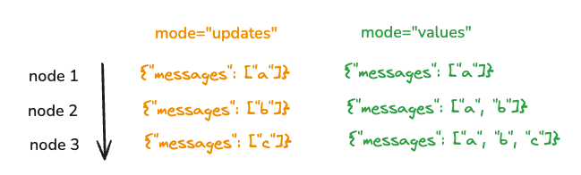

<style>code { white-space: pre; overflow-x: auto; }</style>

[](https://langchain-ai.github.io/langgraph/concepts/streaming/)


# Streaming

엔드유저를 위한 응답형 앱을 구축 중이신가요? 앱 진행 상황에 따라 실시간 업데이트를 제공하는 것은 사용자들의 관심을 유지하는데 매우 중요합니다.

여기 스트리밍할 세 가지 주요 데이터 유형이 있습니다:

1. **워크플로우 진행 상황** (예: 각 그래프 노드가 실행된 후 상태 업데이트 받기).
2. **LLM 토큰**이 생성될 때마다.
3. **사용자 정의 업데이트** (예: "10/100 레코드 가져옴").

<br>

## Streaming graph outputs (`.stream` and `.astream`)

`.stream`과 `.astream`은 그래프 실행 결과를 스트리밍으로 반환하기 위한 동기 및 비동기 메소드입니다. 이러한 메소드를 호출할 때 여러 가지 다른 모드를 지정할 수 있습니다 (예: `graph.stream(..., mode="...")`):

- `"values"`: 그래프의 각 단계가 끝난 후 상태의 전체 값을 스트리밍합니다.
- `"updates"`: 그래프의 각 단계가 끝난 후 상태 업데이트를 스트리밍합니다. 같은 단계에서 여러 업데이트가 이루어지면(예: 여러 노드가 실행됨) 이러한 업데이트는 별도로 스트리밍됩니다.
- `"custom"`: 그래프 노드 내부의 사용자 정의 데이터를 스트리밍합니다.
- `"messages"`: LLM이 호출되는 그래프 노드의 LLM 토큰 및 메타데이터를 스트리밍합니다.
- `"debug"`: 그래프 실행 전반에 걸쳐 가능한 많은 정보를 스트리밍합니다.

여러 스트리밍 모드를 동시에 지정할 수도 있으며, 이 경우 스트리밍된 출력은 튜플 형태`(stream_mode, data)`로 반환됩니다. 예를 들어:

```python
graph.stream(..., stream_mode=["updates", "messages"])
```
```python
...
('messages', (AIMessageChunk(content='Hi'), {'langgraph_step': 3, 'langgraph_node': 'agent', ...}))
...
('updates', {'agent': {'messages': [AIMessage(content="Hi, how can I help you?")]}})
```

아래 시각화는 `values` 모드와 `updates` 모드의 차이를 보여줍니다.



<br>

## LangGraph Platform

스트리밍은 LLM 애플리케이션이 최종 사용자에게 반응형으로 느껴지도록 만드는 데 매우 중요합니다. 스트리밍 실행을 생성할 때, 스트리밍 모드는 API 클라이언트로 어떤 데이터가 스트리밍될지를 결정합니다. LangGraph 플랫폼은 다음의 다섯 가지 스트리밍 모드를 지원합니다:

- `values`: 각 슈퍼 스텝(super-step)이 실행된 후 그래프의 전체 상태를 스트리밍합니다. 값 스트리밍에 대한 자세한 내용은 [이 가이드](../how_to/how_to_stream_full_state_of_your_graph.md)를 참고하세요.
- `messages-tuple`: 노드 내부에서 생성된 메시지의 LLM 토큰을 스트리밍합니다. 이 모드는 주로 채팅 애플리케이션을 구동하는 데 사용됩니다. 메시지 스트리밍에 대한 자세한 내용은 [이 가이드](../how_to/how_to_stream_messages_from_your_graph.md)를 참고하세요.
- `updates`: 각 노드가 실행된 후 그래프 상태의 업데이트를 스트리밍합니다. 업데이트 스트리밍에 대한 자세한 내용은 [이 가이드](../how_to/how_to_stream_state_updates_of_your_graph.md)를 참고하세요.
- `debug`: 그래프 실행 전반에 걸쳐 디버그 이벤트를 스트리밍합니다. 디버그 이벤트 스트리밍에 대한 자세한 내용은 [이 가이드](../how_to/how_to_stream_debug_events.md)를 참고하세요.
- `events`: 그래프 실행 중 발생하는 모든 이벤트(그래프 상태 포함)를 스트리밍합니다. 이 모드는 대규모 LCEL(LangChaing Expression Language) 애플리케이션을 LangGraph로 마이그레이션하는 사용자에게만 유용하며, 대부분의 애플리케이션에서는 필요하지 않습니다. 이벤트 스트리밍에 대한 자세한 내용은 [이 가이드](../how_to/how_to_stream_events.md)를 참고하세요.

여러 스트리밍 모드를 동시에 지정할 수도 있습니다. 여러 스트리밍 모드를 동시에 구성하는 방법에 대한 자세한 내용은 [이 가이드](../how_to/how_to_configure_multiple_streaming_modes_at_the_same_time.md)를 참조하십시오.

스트리밍 실행을 생성하는 방법에 대한 자세한 내용은 [API Reference](https://langchain-ai.github.io/langgraph/cloud/reference/api/api_ref.html#tag/thread-runs/POST/threads/{thread_id}/runs/stream)를 참조하십시오.

`values`, `updates`, `messages-tuple` 및 `debug` 스트리밍 모드는 LangGraph 라이브러리에서 사용 가능한 모드와 매우 유사합니다. 이에 대한 더 깊은 개념적 설명은 [이전 섹션](#streaming-graph-outputs-stream-and-astream)을 참조하십시오.

`events` 스트리밍 모드는 LangGraph 라이브러리에서 `.astream_events`를 사용하는 것과 동일합니다. 

모든 이벤트는 두 가지 속성을 가집니다:
* `event`: 이벤트의 이름입니다.
* `data`: 이벤트와 관련된 데이터입니다.