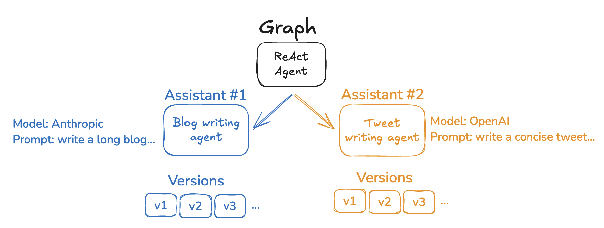

https://langchain-ai.github.io/langgraph/concepts/assistants/

## **어시스턴트**

에이전트를 구축할 때 그래프 논리를 변경하지 않고 빠르게 변경하는 것이 일반적입니다. 예를 들어, 프롬프트나 LLM 선택을 변경하는 것만으로도 에이전트의 동작에 상당한 영향을 미칠 수 있습니다. 어시스턴트는 이러한 유형의 에이전트 구성 변경을 쉽게 만들고 저장할 수 있는 방법을 제공합니다. 이는 최소 두 가지 사용 사례가 있을 수 있습니다:
- 어시스턴트는 개발자가 실험을 위해 에이전트를 쉽게 수정하고 버전 관리할 수 있는 방법을 제공합니다.
- 어시스턴트는 LangGraph Studio를 통해 수정할 수 있어, 비즈니스 사용자를 위한 코드 없는 방식으로 에이전트를 구성할 수 있습니다.

어시스턴트는 "구성" 개념을 기반으로 합니다. "구성"은 오픈 소스 LangGraph 라이브러리에서도 사용할 수 있지만, 어시스턴트는 LangGraph 플랫폼에만 존재합니다. 이는 어시스턴트가 배포된 그래프와 긴밀하게 연결되어 있기 때문에 그래프를 배포할 때만 사용할 수 있습니다.

**어시스턴트 구성**

실제로, 어시스턴트는 특정 구성을 가진 그래프의 인스턴스일 뿐입니다. 따라서 여러 어시스턴트는 동일한 그래프를 참조할 수 있지만, 프롬프트, 모델 및 기타 그래프 구성 옵션과 같은 다른 구성을 포함할 수 있습니다. LangGraph Cloud API는 어시스턴트를 생성하고 관리하기 위한 여러 엔드포인트를 제공합니다. 어시스턴트를 생성하는 방법에 대한 자세한 내용은 API 참조와 [이 방법](#)을 참조하세요.

**어시스턴트 버전 관리**

어시스턴트를 생성한 후에는 구성 변경 사항을 추적하기 위해 저장하고 버전 관리할 수 있습니다. 이를 세 가지 수준에서 생각할 수 있습니다:
1. 그래프는 일반 에이전트 응용 프로그램 논리를 설정합니다.
2. 에이전트 구성 옵션은 변경할 수 있는 매개변수를 나타냅니다.
3. 어시스턴트 버전은 에이전트 구성 옵션의 특정 설정을 저장하고 추적합니다.

예를 들어, 일반적인 글쓰기 에이전트가 있다고 가정해 봅시다. 작성 작업에 잘 작동하는 일반적인 그래프 아키텍처를 만들었습니다. 그러나 블로그와 트윗 같은 다양한 유형의 글쓰기가 있습니다. 각 사용 사례에서 최상의 성능을 얻기 위해 사용되는 모델과 프롬프트를 약간 변경해야 할 수 있습니다. 이 설정에서 각 사용 사례에 대해 하나의 어시스턴트를 생성할 수 있습니다 - 하나는 블로그 작성용, 하나는 트윗용. 이러한 어시스턴트는 동일한 그래프 구조를 공유하지만, 다른 모델과 다른 프롬프트를 사용할 수 있습니다.

어시스턴트 버전 관리를 Studio와 SDK를 통해 어떻게 사용할 수 있는지 자세히 알아보려면 [이 방법](#)을 참조하세요.

