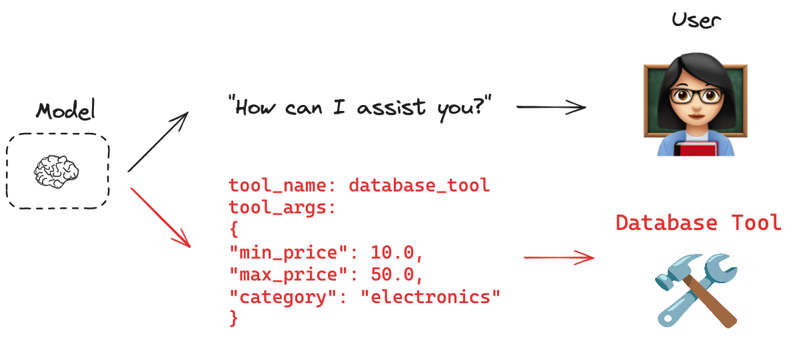
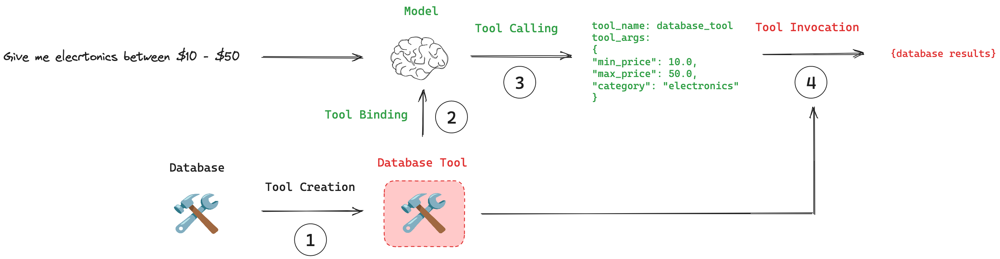

[](https://python.langchain.com/docs/concepts/tool_calling/)


# Tool calling


## Overview

많은 AI 응용 프로그램이 인간과 직접 상호작용합니다. 이러한 경우, 모델이 자연어로 응답하는 것이 적절합니다. 그러나 데이터베이스나 API 같은 시스템과 직접 상호작용해야 하는 경우는 어떨까요? 이러한 시스템은 종종 특정 입력 스키마를 요구하며, 예를 들어 API는 종종 필요한 페이로드 구조를 가집니다. 이 요구는 tool calling의 개념을 탄생시켰습니다. [Tool calling](https://platform.openai.com/docs/guides/function-calling/example-use-cases)을 사용하면 특정 스키마와 일치하는 모델 응답을 요청할 수 있습니다.

> **INFO**  
> Function calling 은 Tool calling 과 동일하게 사용됩니다.



<br>

## Key concepts

1. **Tool Creation**: `@tool` 데코레이터를 사용해 tool을 생성합니다. Tool은 함수와 해당 스키마 사이의 연관성입니다.  
2. **Tool Binding**: Tool은 tool calling을 지원하는 모델에 연결되어야 합니다. 이를 통해 모델이 tool과 관련된 입력 스키마를 인지할 수 있습니다.  
3. **Tool Calling**: 적절한 경우, 모델은 tool을 호출하도록 결정하며, 응답이 tool의 입력 스키마를 준수하도록 보장합니다.  
4. **Tool Execution**: 모델이 제공한 인수를 사용해 tool을 실행할 수 있습니다.  



<br>

## Recoomanded usage

아래의 pseudo-code는 tool calling을 사용하는 권장 워크플로를 보여줍니다. 생성된 도구는 `.bind_tools()` 메서드로 리스트 형태로 전달됩니다. 이렇게 생성된 모델을 평소처럼 호출할 수 있습니다. Toll call이 만들어졌다면, 모델 응답에는 tool call arguments가 포함됩니다. 이 tool call arguments tool에 직접 전달할 수 있습니다.

```python
# Tool creation
tools = [my_tool]

# Tool binding
model_with_tools = model.bind_tools(tools)

# Tool calling
response = model_with_tools.invoke(user_input)
```

<br>

## Tool creation

Tool을 생성하는 가장 권장되는 방법은 `@tool` 데코레이터를 사용하는 것입니다.

```python
from langchain_core.tools import tool

@tool
def multiply(a: int, b: int) -> int:
    """a와 b를 곱합니다."""
    return a * b
```
API Reference: [tool](https://python.langchain.com/api_reference/core/tools/langchain_core.tools.convert.tool.html)

<br>

## Tool binding

많은 모델 제공자들이 도구 호출을 지원합니다.  

**TIP**  
도구 호출을 지원하는 제공자 목록은 [모델 통합 페이지](https://python.langchain.com/docs/integrations/)에서 확인하세요.  

LangChain은 도구를 모델에 연결하기 위한 표준화된 인터페이스를 제공합니다. `.bind_tools()` 메서드를 사용해 모델이 호출할 수 있는 도구를 지정할 수 있습니다.  

```python
model_with_tools = model.bind_tools(tools_list)
```

### 예시
다음은 `multiply` 함수를 도구로 바인딩하여 도구 호출을 지원하는 모델에 연결하는 예제입니다:

```python
def multiply(a: int, b: int) -> int:
    """a와 b를 곱합니다.
    
    Args:
        a: 첫 번째 정수
        b: 두 번째 정수
    """
    return a * b

llm_with_tools = tool_calling_model.bind_tools([multiply])
```

---

### 도구 호출
도구 호출의 핵심 원칙은 입력의 관련성에 따라 모델이 도구를 사용할지 여부를 스스로 결정한다는 점입니다. 모델이 항상 도구를 호출해야 하는 것은 아닙니다.

예를 들어, 관련 없는 입력을 받은 경우 모델은 도구를 호출하지 않습니다:

```python
result = llm_with_tools.invoke("Hello world!")
```

이 결과는 모델의 응답이 자연어로 포함된 `AIMessage` 객체로 반환됩니다(예: "Hello!").  
그러나 도구와 관련 있는 입력을 제공하면, 모델은 도구를 호출하기로 결정할 수 있습니다:

```python
result = llm_with_tools.invoke("What is 2 multiplied by 3?")
```

위와 마찬가지로 출력 결과는 여전히 `AIMessage`입니다. 하지만 도구가 호출된 경우, `result` 객체에는 `tool_calls` 속성이 포함됩니다. 이 속성에는 도구 이름과 입력 인수를 포함하여 도구 실행에 필요한 모든 것이 들어 있습니다:

```python
result.tool_calls
{'name': 'multiply', 'args': {'a': 2, 'b': 3}, 'id': 'xxx', 'type': 'tool_call'}
```

더 자세한 사용 방법은 [사용 가이드](https://python.langchain.com/docs/concepts/tool_calling/)를 참조하세요!

---

### 도구 실행
도구는 `Runnable` 인터페이스를 구현하므로, `tool.invoke(args)`를 사용해 직접 호출할 수 있습니다.  

LangGraph는 사전 빌드된 구성 요소(`ToolNode` 등)를 제공하며, 이를 통해 사용자를 대신하여 도구를 호출할 수 있습니다.  

---

**참고 문서**  
- [도구 호출 사용 가이드](https://python.langchain.com/docs/concepts/tool_calling/)  
- [LangGraph의 ToolNode 사용 문서](https://python.langchain.com/docs/concepts/tool_calling/)  

---

### 모범 사례
도구를 설계할 때 염두에 두어야 할 점:  
- 명확한 도구 호출 API를 가진 모델이 비튜닝 모델보다 도구 호출을 더 잘 수행합니다.  
- 잘 선택된 이름과 설명을 가진 도구는 모델 성능을 향상시킵니다.  
- 단순하고 좁은 범위로 설계된 도구가 복잡한 도구보다 사용이 더 쉽습니다.  
- 많은 도구 목록에서 선택하도록 요청하면 모델에 부담이 될 수 있습니다.  


