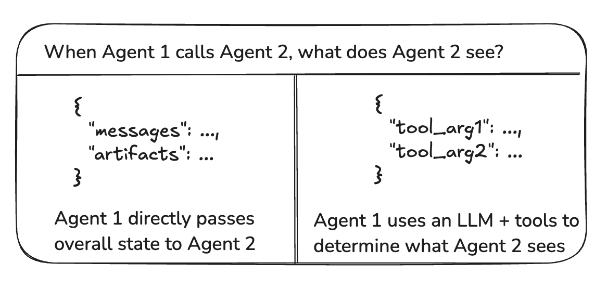
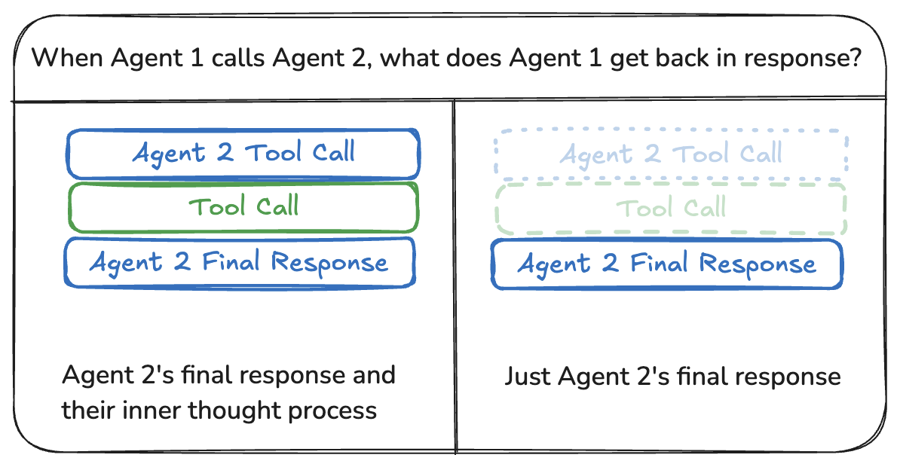

<style>code { white-space: pre; overflow-x: auto; }</style>

[](https://langchain-ai.github.io/langgraph/concepts/multi_agent/)


# Multi-agent System

[agent](./agent_architectures.md)는 LLM을 사용하여 애플리케이션의 제어 흐름을 결정하는 시스템입니다. 이러한 시스템을 개발하면서 시간이 지남에 따라 더 복잡해지고 관리와 확장이 어려워질 수 있습니다. 예를 들어, 다음과 같은 문제에 직면할 수 있습니다:

- 에이전트가 사용할 수 있는 도구가 너무 많아 다음에 어떤 도구를 호출할지 잘못된 결정을 내림.
- 단일 에이전트가 모든 컨텍스트를 추적하기에 너무 복잡해짐.
- 시스템 내에서 여러 전문화 영역(예: 기획자, 연구원, 수학 전문가 등)이 필요함.

이 문제를 해결하기 위해 애플리케이션을 여러 개의 작고 독립적인 에이전트로 나눠 다중 에이전트 시스템으로 구성할 수 있습니다. 이러한 독립 에이전트는 단순히 프롬프트와 LLM 호출로 구성될 수도 있고, 복잡하게는 [ReAct](./agent_architectures.md#react-implementation) 에이전트 등으로 구성될 수도 있습니다.

다중 에이전트 시스템의 주요 이점은
- **모듈성(Modularity)**: 독립된 에이전트로 구성하면 에이전트 시스템을 개발, 테스트 및 유지 관리하기가 더 쉬워집니다.
- **전문화(Specialization)**: 특정 도메인에 집중하는 전문 에이전트를 만들 수 있어 시스템 성능이 향상됩니다.
- **제어(Control)**: 함수 호출에 의존하지 않고 에이전트가 어떻게 통신할지 명시적으로 제어할 수 있습니다.

<br>

## Multi-agent architectures


다중 에이전트 시스템에서 에이전트를 연결하는 방법에는 여러 가지가 있습니다:

- **Network**: 각 에이전트는 [다른 모든 에이전트](../tutorials/multi_agent_network.md)와 통신할 수 있습니다. 어떤 에이전트를 다음에 호출할지 각 에이전트가 결정합니다.
- **Supervisor**: 각 에이전트는 오직 단일 [supervisor](../tutorials/multi_agent_supervisor.md) 에이전트와 통신합니다. Supervisor 에이전트가 다음에 호출할 에이전트를 결정합니다.
- **Supervisor - tool-calling**: Supervisor 아키텍처의 특별한 사례로, 개별 에이전트를 도구로 표현합니다. 이 경우 supervisor 에이전트는 tool calling LLM을 사용하여 호출할 에이전트 도구와 전달할 인수를 결정합니다.
- **Hierarchical**: Supervisor의 일반화된 형태로, [supervisors의 supervisor](../tutorials/hierarchical_agent_teams.md)를 통해 더 복잡한 제어 흐름을 정의할 수 있습니다.
- **Custom multi-agent workflow**: 각 에이전트는 특정 하위 에이전트와만 통신합니다. 흐름의 일부는 결정론적이며, 일부 에이전트만 다른 에이전트를 호출할 수 있습니다.


### Handoffs

다중 에이전트 아키텍처에서는 에이전트를 그래프의 노드로 표현할 수 있습니다. 각 에이전트 노드는 자신의 단계(step)를 실행한 후, 실행을 종료할지 또는 다른 에이전트로 라우팅할지(자신에게 다시 라우팅하여 루프를 실행하는 경우 포함) 결정합니다. 다중 에이전트 상호작용에서 흔히 볼 수 있는 패턴 중 하나는 **handoffs**로, 한 에이전트가 다른 에이전트로 제어를 넘기는 것을 말합니다. handoffs를 통해 다음을 지정할 수 있습니다:

- **destination**: 이동할 대상 에이전트(예: 이동하려는 노드의 이름).
- **payload**: [해당 에이전트에 전달할 정보](#communication_between_agents)(예: 상태 업데이트).

LangGraph에서 Handoffs를 구현하려면 에이전트 노드가 제어 흐름과 상태 업데이트를 결합하는 `Command` 객체를 반환해야 합니다:

```python
def agent(state) -> Command[Literal["agent", "another_agent"]]:
    # 라우팅 또는 중단을 결정하는 조건 (예: LLM tool call / structured output 등).
    goto = get_next_agent(...)  # 'agent' / 'another_agent'
    return Command(
        # 다음에 호출할 에이전트 지정
        goto=goto,
        # 그래프 상태 업데이트
        update={"my_state_key": "my_state_value"}
    )
```

각 에이전트 노드가 [subgraph](../concepts/langgraph_glossary.md#subgraphs)인 경우와 같이 좀 더 복잡한 경우, 특정 subgraph의 노드에서 다른 에이전트로 이동을 할 수 있습니다. 예를 들어, 같은 부모 그래프의 subgraph인 두 개의 에이전트 `alice`와 `bob`이 있고, `alice`가 `bob`으로 이동해야 하는 경우, `Command` 객체에 `graph=Command.PARENT`를 설정할 수 있습니다:

```python
def some_node_inside_alice(state):
    return Command(
        goto="bob",
        update={"my_state_key": "my_state_value"},
        # 이동할 그래프 지정 (기본값은 현재 그래프)
        graph=Command.PARENT,
    )
```

> **Note**  
> Subgraph가 `Command(graph=Command.PARENT)`를 사용해 통신하는 과정을 시각적으로 확인하기 위해서는 `Command` 노드를 함수로 감싸야 합니다. 예를 들어, 아래와 같은 방식 대신:
> ```python
> builder.add_node(alice)
> ```
> 다음과 같이 작성해야 합니다:
> ```python
> def call_alice(state) -> Command[Literal["bob"]]:
>    return alice.invoke(state)
>
> builder.add_node("alice", call_alice)
> ```


#### Handoffs as tools

가장 일반적인 에이전트 유형 중 하나는 ReAct-style tool-calling 에이전트 입니다. 이러한 유형의 에이전트의 일반적인 패턴은 Handoffs를 도구 호출로 감싸는 것입니다. 예:

```python
def transfer_to_bob(state):
    """bob으로 전환."""
    return Command(
        goto="bob",
        update={"my_state_key": "my_state_value"},
        graph=Command.PARENT,
    )
```

이는 도구에서 그래프 상태를 업데이트하는 특수한 경우로, 상태 업데이트 외에도 제어 흐름이 포함됩니다.

> **Important**  
> `Command`를 반환하는 도구를 사용하려면, 미리 빌드된 `create_react_agent`/`ToolNode` 구성 요소를 사용하거나, 도구에서 반환된 `Command` 객체를 수집하고 해당 목록을 반환하는 자체 도구 실행 노드를 구현해야 합니다. 예:

```python
def call_tools(state):
    ...
    commands = [tools_by_name[tool_call["name"]].invoke(tool_call) for tool_call in tool_calls]
    return commands
```

이제 다양한 다중 에이전트 아키텍처에 대해 더 자세히 살펴보겠습니다.

<br>

### Network

이 아키텍처에서는 에이전트를 그래프 노드로 정의합니다. 각 에이전트는 다른 모든 에이전트와 통신할 수 있으며(다대다 연결), 다음에 호출할 에이전트를 스스로 결정할 수 있습니다. 이 아키텍처는 에이전트의 계층 구조가 명확하지 않거나 호출 순서가 특정되지 않은 문제에 적합합니다.

```python
from typing import Literal
from langchain_openai import ChatOpenAI
from langgraph.types import Command
from langgraph.graph import StateGraph, MessagesState, START, END

model = ChatOpenAI()

def agent_1(state: MessagesState) -> Command[Literal["agent_2", "agent_3", END]]:
    # 상태(state)의 일부분을 LLM에 전달하여 다음에 호출할 에이전트를 결정할 수 있습니다.
    # 일반적인 패턴은 structured output (예: "next_agent" 필드를 포함한 출력)을 반환하도록 모델을 호출하는 것입니다.
    response = model.invoke(...)
    # LLM의 결정에 따라 에이전트로 라우팅하거나 실행을 종료합니다.
    # LLM이 "__end__"를 반환하면 그래프 실행이 종료됩니다.
    return Command(
        goto=response["next_agent"],
        update={"messages": [response["content"]]},
    )

def agent_2(state: MessagesState) -> Command[Literal["agent_1", "agent_3", END]]:
    response = model.invoke(...)
    return Command(
        goto=response["next_agent"],
        update={"messages": [response["content"]]},
    )

def agent_3(state: MessagesState) -> Command[Literal["agent_1", "agent_2", END]]:
    ...
    return Command(
        goto=response["next_agent"],
        update={"messages": [response["content"]]},
    )

builder = StateGraph(MessagesState)
builder.add_node(agent_1)
builder.add_node(agent_2)
builder.add_node(agent_3)

builder.add_edge(START, "agent_1")
network = builder.compile()
```
API Reference: ChatOpenAI | Command | StateGraph | START | END


### Supervisor

이 아키텍처에서는 에이전트를 노드로 정의하고, 호출할 에이전트 노드를 결정하는 supervisor 노드(LLM)를 추가합니다. `Command`를 사용하여 supervisor의 결정에 따라 적절한 에이전트 노드로 실행을 라우팅합니다. 여러 에이전트를 병렬로 실행하거나 [map-reduce](../how_to/how_to_create_map_reduce_branchs_for_parallel_execution.md) 패턴에 적합합니다.

```python
from typing import Literal
from langchain_openai import ChatOpenAI
from langgraph.types import Command
from langgraph.graph import StateGraph, MessagesState, START, END

model = ChatOpenAI()

def supervisor(state: MessagesState) -> Command[Literal["agent_1", "agent_2", END]]:
    # 상태(state)의 일부분을 LLM에 전달하여 다음에 호출할 에이전트를 결정할 수 있습니다.
    # 일반적인 패턴은 structured output (예: "next_agent" 필드를 포함한 출력)을 반환하도록 모델을 호출하는 것입니다.
    response = model.invoke(...)
    # Supervisor의 결정에 따라 에이전트로 라우팅하거나 실행을 종료합니다.
    # Supervisor이 "__end__"를 반환하면 그래프 실행이 종료됩니다.
    return Command(goto=response["next_agent"])

def agent_1(state: MessagesState) -> Command[Literal["supervisor"]]:
    # 상태(state)의 관련 부분을 LLM에 전달하고 추가적인 로직(다른 모델, 사용자 정의 프롬프트 등)을 추가할 수 있습니다.
    response = model.invoke(...)
    return Command(
        goto="supervisor",
        update={"messages": [response]},
    )

def agent_2(state: MessagesState) -> Command[Literal["supervisor"]]:
    response = model.invoke(...)
    return Command(
        goto="supervisor",
        update={"messages": [response]},
    )

builder = StateGraph(MessagesState)
builder.add_node(supervisor)
builder.add_node(agent_1)
builder.add_node(agent_2)

builder.add_edge(START, "supervisor")

supervisor = builder.compile()
```

API Reference: ChatOpenAI | Command | StateGraph | START | END

추가적으로 Supervisor 다중 에이전트 아키텍쳐의 예제를 확인하려면 [이 가이드](../tutorials/multi_agent_supervisor.md)를 참고하세요.


### Supervisor (tool-calling)

이 [supervisor](#supervisor) 아키텍처의 변형은 개별 에이전트를 **도구**로 정의하고, supervisor 노드에서 tool-calling LLM을 사용합니다. 이 아키텍처의 구현은 LLM 노드(supervisor)와 도구를 실행하는 tool-calling 노드(이 경우 에이전트)로 구성된 ReAct-style의 에이전트로 구현할 수 있습니다.

```python
from typing import Annotated
from langchain_openai import ChatOpenAI
from langgraph.prebuilt import InjectedState, create_react_agent

model = ChatOpenAI()

# 도구로 호출될 에이전트 함수입니다.
# InjectedState annotation을 통해 상태를 도구에 전달할 수 있습니다.
def agent_1(state: Annotated[dict, InjectedState]):
    # 상태(state)의 일부분을 LLM에 전달하고 (예: state["messages"]),
    # 추가 로직(다른 모델, 사용자 정의 프롬프트, 구조화된 출력 등)을 추가할 수 있습니다.
    response = model.invoke(...)
    # LLM 응답을 문자열로 반환합니다(기대되는 도구 응답 형식).
    # 미리 만들어진 create_react_agent(supervisor)에 의해 자동으로 ToolMessage로 변환됩니다.
    return response.content

def agent_2(state: Annotated[dict, InjectedState]):
    response = model.invoke(...)
    return response.content

tools = [agent_1, agent_2]

# supervisor w/ tool-calling 구축하는 가장 간단한 방법은
# tool-calling LLM 노드(즉, supervisor)와 도구 실행 노드로 구성된 미리 작성된 ReAct 에이전트 그래프를 사용하는 것입니다.
supervisor = create_react_agent(model, tools)
```

API 참고 자료: [ChatOpenAI](https://langchain-openai.readthedocs.io/en/latest/) | [InjectedState](https://langgraph.readthedocs.io/en/latest/) | [create_react_agent](https://langgraph.readthedocs.io/en/latest/)


### Hierarchical

시스템에 더 많은 에이전트를 추가할수록 supervisor가 모든 에이전트를 관리하기 어려워질 수 있습니다. Supervisor가 어떤 에이전트를 다음에 호출할지 잘못된 결정을 내리거나, 컨텍스트가 너무 복잡해져 하나의 supervisor가 이를 모두 추적하지 못할 수 있습니다. 다시 말해, 처음에 다중 에이전트 아키텍처를 설계하게 된 동기와 동일한 문제에 직면하게 됩니다.

이를 해결하기 위해 시스템을 *계층적*으로 설계할 수 있습니다. 예를 들어, 각각의 supervisor가 관리하는 전문화된 에이전트 그룹과 그룹을 관리하는 최상위 supervisor를 생성할 수 있습니다.

```python
from typing import Literal
from langchain_openai import ChatOpenAI
from langgraph.graph import StateGraph, MessagesState, START, END
from langgraph.types import Command

model = ChatOpenAI()

# 팀 1 정의 (단일 supervisor 예제와 동일)
def team_1_supervisor(state: MessagesState) -> Command[Literal["team_1_agent_1", "team_1_agent_2", END]]:
    response = model.invoke(...)
    return Command(goto=response["next_agent"])

def team_1_agent_1(state: MessagesState) -> Command[Literal["team_1_supervisor"]]:
    response = model.invoke(...)
    return Command(goto="team_1_supervisor", update={"messages": [response]})

def team_1_agent_2(state: MessagesState) -> Command[Literal["team_1_supervisor"]]:
    response = model.invoke(...)
    return Command(goto="team_1_supervisor", update={"messages": [response]})

team_1_builder = StateGraph(Team1State)
team_1_builder.add_node(team_1_supervisor)
team_1_builder.add_node(team_1_agent_1)
team_1_builder.add_node(team_1_agent_2)
team_1_builder.add_edge(START, "team_1_supervisor")
team_1_graph = team_1_builder.compile()

# 팀 2 정의 (단일 supervisor 예제와 동일)
class Team2State(MessagesState):
    next: Literal["team_2_agent_1", "team_2_agent_2", "__end__"]

def team_2_supervisor(state: Team2State):
    ...

def team_2_agent_1(state: Team2State):
    ...

def team_2_agent_2(state: Team2State):
    ...

team_2_builder = StateGraph(Team2State)
...
team_2_graph = team_2_builder.compile()

# 최상위 supervisor 정의
builder = StateGraph(MessagesState)

def top_level_supervisor(state: MessagesState) -> Command[Literal["team_1_graph", "team_2_graph", END]]:
    # 상태(state)의 일부분을 LLM에 전달하여 다음에 호출할 팀을 결정합니다.
    # 일반적인 패턴은 "next_team" 필드가 존재하는 structured output을 반환하도록 모델을 호출하는 것입니다.
    response = model.invoke(...)
    # 최상위 supervisor의 결정에 따라 하나의 팀으로 라우팅하거나 실행을 종료합니다.
    # 최상위 supervisor가 "__end__"를 반환하면 그래프 실행이 종료됩니다.
    return Command(goto=response["next_team"])

builder = StateGraph(MessagesState)
builder.add_node(top_level_supervisor)
builder.add_node("team_1_graph", team_1_graph)
builder.add_node("team_2_graph", team_2_graph)
builder.add_edge(START, "top_level_supervisor")
builder.add_edge("team_1_graph", "top_level_supervisor")
builder.add_edge("team_2_graph", "top_level_supervisor")
graph = builder.compile()
```
API Reference: [ChatOpenAI](https://langchain-openai.readthedocs.io/en/latest/) | [StateGraph](https://langgraph.readthedocs.io/en/latest/) | [START](https://langgraph.readthedocs.io/en/latest/) | [END](https://langgraph.readthedocs.io/en/latest/) | [Command](https://langgraph.readthedocs.io/en/latest/)


### Custom multi-agent workflow

이 아키텍처에서는 개별 에이전트를 그래프 노드로 추가하고, 에이전트가 호출되는 순서를 미리 정의된 사용자 정의 워크플로에서 설정합니다. LangGraph에서 워크플로는 두 가지 방법으로 정의할 수 있습니다:

- **명시적 제어 흐름(normal edges)**: LangGraph를 사용하면 [일반 그래프 엣지](./langgraph_glossary.md#normal-edges)를 통해 애플리케이션의 제어 흐름(에이전트가 통신하는 순서)을 명시적으로 정의할 수 있습니다. 이는 이 아키텍처에서 가장 결정론적인 변형으로, 다음에 어떤 에이전트가 호출될지 항상 미리 알 수 있습니다.
- **동적 제어 흐름(Command)**: LangGraph에서는 애플리케이션 제어 흐름의 일부를 LLM이 결정하도록 설정할 수 있습니다. 이는 `Command`를 사용하여 구현할 수 있습니다. 이 방식의 특별한 사례는 supervisor tool-calling 아키텍처입니다. 이 경우 supervisor 에이전트를 구동하는 tool-calling LLM이 도구(에이전트)가 호출되는 순서를 결정합니다.

```python
from langchain_openai import ChatOpenAI
from langgraph.graph import StateGraph, MessagesState, START

model = ChatOpenAI()

def agent_1(state: MessagesState):
    response = model.invoke(...)
    return {"messages": [response]}

def agent_2(state: MessagesState):
    response = model.invoke(...)
    return {"messages": [response]}

builder = StateGraph(MessagesState)
builder.add_node(agent_1)
builder.add_node(agent_2)
# 흐름을 명시적으로 정의
builder.add_edge(START, "agent_1")
builder.add_edge("agent_1", "agent_2")
```
API Reference: [ChatOpenAI](https://langchain-openai.readthedocs.io/en/latest/) | [StateGraph](https://langgraph.readthedocs.io/en/latest/) | [START](https://langgraph.readthedocs.io/en/latest/)

<br>

## Communication between agents

다중 에이전트 시스템을 구축할 때 가장 중요한 것은 에이전트 간의 **통신 방식**을 결정하는 것입니다. 이를 위해 다음과 같은 고려 사항이 있습니다:

- 에이전트들은 graph state 혹은 tool calls 로 통신하는가?
- 만약 두 에이전트가 서로 다른 state schema를 가지면 어떻게 해야 할까요?
- 어떻게 shared message list를 통해 통신할 수 있을까요?

### Graph state vs tool calls

에이전트 간에 전달되는 "payload"는 무엇일까요? 위에서 설명한 여러가지의 아키텍처 중 대부분의 아키텍처에서 에이전트는 graph state를 통해 통신합니다. 그러나 supervisor with tool-calling 아키텍처에서는 tool call arguments입니다.



#### Graph state

Graph state를 통해 통신하려면 개별 에이전트를 그래프 노드로 정의해야 합니다. 그래프 노드는 function 또는 subgraphs로 정의 될 수 있습니다. 그래프 실행의 각 단계에서, 에이전트 노드는 현재 그래프 상태를 받은 뒤 에이전트 코드를 실행하고 업데이트된 상태를 다음 노드에 전달합니다.

일반적으로 에이전트 노드는 state schema를 공유합니다. 하지만, 경우에 따라 서로 다른 상태 스키마를 가진 에이전트를 설계해야 할 수도 있습니다.


### Different state schemas

어떤 에이전트는 나머지 에이전트와는 다른 상태 스키마가 필요할 수 있습니다. 예를 들어, 검색 에이전트는 queries와 retrieved documents만 필요할 수 있습니다.
LangGraph에서 이를 구현하는 방법은 다음 두 가지입니다:

- 별도의 state schema 로 subgraph 를 정의합니다. subgraph와 상위 그래프 간에 공유 상태 키(channel)가 없을 경우, [input/output transformations](../how_to/how_to_transform_inputs_and_outputs_of_a_subgraph.md)을 추가하여 상위 그래프가 subgraph 와 통신하는 방법을 알려줘야 합니다.
- [Private input state schema](../how_to/how_to_pass_private_state_between_nodes.md) 로 node function 을 정의하여 전체 state schema 와 분리합니다. 이를 통해 해당 에이전트를 실행하는 데만 필요한 정보를 전달할 수 있습니다.


### Shared message list

에이전트 간 통신의 가장 일반적인 방법은 shared state channel(일반적으로 메시지 리스트)를 통해 이루어집니다. 이를 위한 전제조건은 state에 에이전트 간에 공유되는 최소 하나의 채널(키)이 항상 존재해야 합니다. Shared message list를 통해 통신할 때는 다음과 같은 추가적인 고려 사항이 있습니다: 에이전트는 전체 사고 과정의 full history을 공유해야 할까요, 아니면 final result만 공유해야 할까요?



#### Share full history

에이전트는 사고 과정("scratchpad")의 전체 기록을 다른 모든 에이전트와 공유할 수 있습니다. 이 "scratchpad"는 일반적으로 [메시지 리스트](../concepts/langgraph_glossary.md#why-use-messages) 형태로 나타납니다.

- **benefit** : 전체 사고 과정을 공유하면 다른 에이전트가 더 나은 결정을 내리도록 돕고, 시스템 전체의 추론 능력을 향상시킬 수 있습니다.
- **downside** : 에이전트의 수와 복잡성이 증가함에 따라 "scratchpad"가 빠르게 커질 수 있으며, [메모리 관리](../concepts/memory.md#managing-long-conversation-history)에 추가적인 전략이 필요할 수 있습니다.

#### Share final result

에이전트는 자신의 private "scratchpad"를 갖고, 최종 결과만 다른 에이전트와 공유할 수도 있습니다. 이 접근 방식은 많은 수의 에이전트 또는 더 복잡한 에이전트로 구성된 시스템에서 더 적합할 수 있습니다. 이 경우, [서로 다른 상태 스키마](#different-state-schemas)를 가진 에이전트를 정의해야 할 수도 있습니다.

에이전트가 도구로써 호출되는 경우, supervisor가 tool schema를 기반으로 입력값을 결정합니다. 또한 LangGraph는 런타임에서 개별 도구에 [상태를 전달](../how_to/how_to_pass_runtime_values_to_tools.md#pass_graph_state_to_tool)하는 기능을 지원하므로, 하위 에이전트가 필요할 경우 상위 상태에 접근할 수 있습니다.
