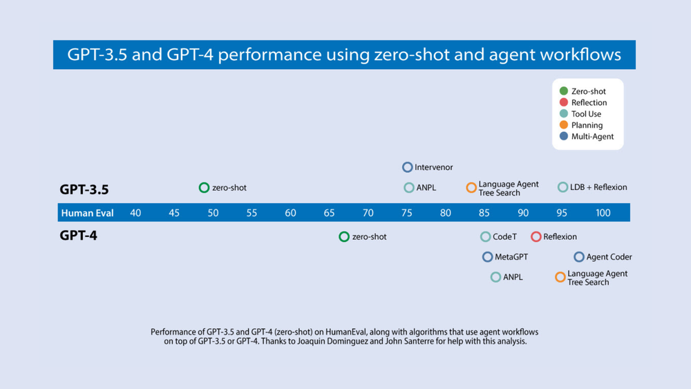

[![Deeplearning.AI](https://img.shields.io/badge/DeepLearning.AI-Article-red.svg?logo=data:image/svg+xml;base64,PHN2ZyB4bWxucz0iaHR0cDovL3d3dy53My5vcmcvMjAwMC9zdmciIGlkPSJMYXllcl8xIiBkYXRhLW5hbWU9IkxheWVyIDEiIHZpZXdCb3g9IjAgMCAzMzIuOCAzMzEuNzQiPg0KICAgIDxkZWZzIHhtbG5zPSJodHRwOi8vd3d3LnczLm9yZy8yMDAwL3N2ZyI+PHN0eWxlPi5jbHMtMXtmaWxsOiNmNWY1ZjU7ZmlsbC1ydWxlOmV2ZW5vZGQ7fTwvc3R5bGU+PC9kZWZzPg0KICAgIDxwYXRoIGNsYXNzPSJjbHMtMSIgZD0iTTE1My41IDE2MkMxOTAuMjI3IDE2MiAyMjAgMTMyLjIyNyAyMjAgOTUuNUMyMjAgNTguNzczMSAxOTAuMjI3IDI5IDE1My41IDI5QzExNi43NzMgMjkgODcgNTguNzczMSA4NyA5NS41Qzg3IDEzMi4yMjcgMTE2Ljc3MyAxNjIgMTUzLjUgMTYyWk0xNTMgMTA0QzE3MS43NzggMTA0IDE4NyA4OC43Nzc3IDE4NyA3MEMxODcgNTEuMjIyMyAxNzEuNzc4IDM2IDE1MyAzNkMxMzQuMjIyIDM2IDExOSA1MS4yMjIzIDExOSA3MEMxMTkgODguNzc3NyAxMzQuMjIyIDEwNCAxNTMgMTA0WiIgZmlsbD0iI0ZGNEE2MSIvPg0KICAgIDxwYXRoIGNsYXNzPSJjbHMtMSIgZD0iTTI1NSAxMTYuNUMyNTUgMTcyLjU1NyAyMDkuNTU3IDIxOCAxNTMuNSAyMThDOTcuNDQzMSAyMTggNTIgMTcyLjU1NyA1MiAxMTYuNUM1MiA2MC40NDMxIDk3LjQ0MzEgMTUgMTUzLjUgMTVDMjA5LjU1NyAxNSAyNTUgNjAuNDQzMSAyNTUgMTE2LjVaTTIzMCAxMDAuNUMyMzAgMTQyLjc1IDE5NS43NSAxNzcgMTUzLjUgMTc3QzExMS4yNSAxNzcgNzcgMTQyLjc1IDc3IDEwMC41Qzc3IDU4LjI1MDIgMTExLjI1IDI0IDE1My41IDI0QzE5NS43NSAyNCAyMzAgNTguMjUwMiAyMzAgMTAwLjVaIiBmaWxsPSIjRkY0QTYxIi8+DQogICAgPHBhdGggY2xhc3M9ImNscy0xIiBkPSJNMTUzIDMwNkMyMzcuNSAzMDYgMzA2IDIzNy41IDMwNiAxNTNDMzA2IDY4LjUwMDQgMjM3LjUgMCAxNTMgMEM2OC41MDA0IDAgMCA2OC41MDA0IDAgMTUzQzAgMjM3LjUgNjguNTAwNCAzMDYgMTUzIDMwNlpNMTUzIDI0NkMyMTguMTcgMjQ2IDI3MSAxOTMuMTcgMjcxIDEyOEMyNzEgNjIuODMwNCAyMTguMTcgMTAgMTUzIDEwQzg3LjgzMDQgMTAgMzUgNjIuODMwNCAzNSAxMjhDMzUgMTkzLjE3IDg3LjgzMDQgMjQ2IDE1MyAyNDZaIiBmaWxsPSIjRkY0QTYxIi8+DQo8L3N2Zz4=)](https://www.deeplearning.ai/the-batch/how-agents-can-improve-llm-performance/)

# Agentic Design Patterns Part 1

친애하는 친구들에게,

저는 올해 AI 에이전트 워크플로가 다음 세대의 기초 모델보다 더 큰 AI 발전을 이끌 것이라고 생각합니다. 이것은 중요한 트렌드이며, AI 작업을 하는 모든 사람들이 주목할 것을 권장합니다.

오늘날 우리는 대부분 LLM을 제로샷 모드에서 사용하여 모델이 작업을 수정하지 않고 토큰 단위로 최종 출력을 생성하도록 프롬프트합니다. 이는 누군가가 에세이를 처음부터 끝까지 작성하도록 요청하고, 백스페이싱 없이 바로 타이핑하게 하여 높은 품질의 결과를 기대하는 것과 같습니다. 그 어려움에도 불구하고, LLM은 이 작업을 놀랍도록 잘 수행합니다!

그러나 에이전트 워크플로를 사용하면, 우리는 LLM에게 문서를 여러 번 반복하도록 요청할 수 있습니다. 예를 들어, 다음과 같은 일련의 단계를 수행할 수 있습니다:

* 개요 계획.
* 추가 정보 수집을 위해 필요한 웹 검색 여부 결정.
* 첫 번째 초안 작성.
* 첫 번째 초안을 읽어보고 부당한 주장이나 불필요한 정보를 찾아내기.
* 발견된 약점을 고려하여 초안 수정.
* 등등.

이 반복적인 과정은 대부분의 인간 작가들이 좋은 텍스트를 작성하는 데 중요합니다. AI와 함께 이러한 반복 워크플로는 단일 패스로 작성하는 것보다 훨씬 나은 결과를 얻을 수 있습니다.

Devin의 화려한 데모는 최근 많은 소셜 미디어에서 화제를 모았습니다. 제 팀은 코드 작성 AI의 진화를 면밀히 추적해왔습니다. 우리는 여러 연구팀의 결과를 분석하여, 널리 사용되는 HumanEval 코딩 벤치마크에서 알고리즘의 성과를 중점적으로 살펴보았습니다. 아래 다이어그램에서 우리의 발견을 확인할 수 있습니다.

GPT-3.5 (제로샷) 정확도는 48.1%였으며, GPT-4 (제로샷)는 67.0%로 더 나은 성과를 보였습니다. 그러나 GPT-3.5에서 GPT-4로의 향상은 반복 에이전트 워크플로를 통합함으로써 무색해집니다. 실제로 에이전트 루프에 포장된 GPT-3.5는 최대 95.1%의 성과를 달성합니다.

오픈 소스 에이전트 도구와 에이전트에 관한 학술 문헌이 급증하고 있어 흥미로운 시기이지만 혼란스럽기도 합니다. 이 작업을 관점에서 이해하는 데 도움이 되도록 에이전트를 구축하기 위한 디자인 패턴을 분류하는 프레임워크를 공유하고자 합니다. 저의 팀 AI 펀드가 많은 응용 프로그램에서 이 패턴을 성공적으로 사용하고 있으며, 여러분에게도 유용하길 바랍니다.

- **반성(Reflection)**: LLM이 자신의 작업을 검토하여 개선 방법을 찾아냅니다.
- **도구 사용(Tool Use)**: LLM에게 웹 검색, 코드 실행 또는 정보 수집, 행동 수행, 데이터 처리를 돕는 기타 기능이 제공됩니다.
- **계획(Planning)**: LLM이 목표를 달성하기 위해 다단계 계획을 세우고 실행합니다 (예: 에세이 개요 작성, 온라인 조사, 초안 작성 등).
- **다중 에이전트 협업(Multi-agent collaboration)**: 여러 AI 에이전트가 함께 작업을 분담하고 아이디어를 논의하고 토론하여 단일 에이전트보다 더 나은 솔루션을 도출합니다.

다음 주에는 이 디자인 패턴들에 대해 더 자세히 설명하고 각 패턴에 대한 추천 읽을거리를 제공하겠습니다.

계속해서 배워나가세요!