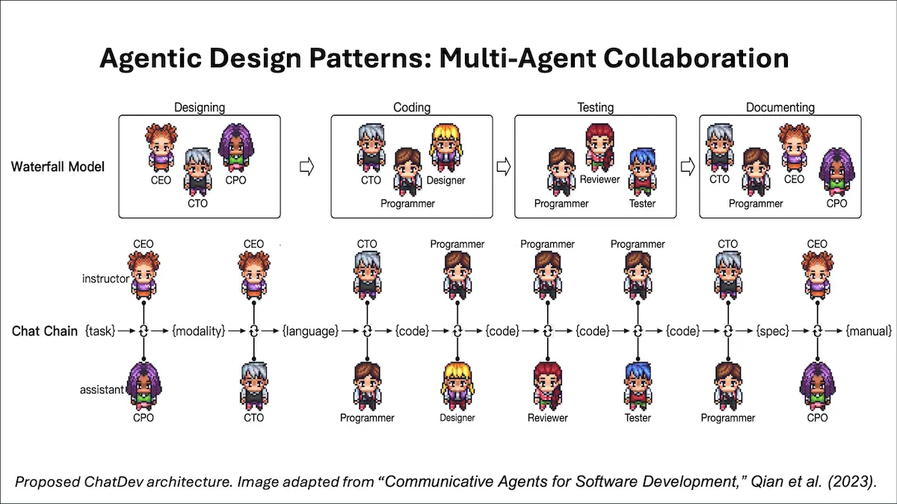

[![Deeplearning.AI](https://img.shields.io/badge/DeepLearning.AI-Article-red.svg?logo=data:image/svg+xml;base64,PHN2ZyB4bWxucz0iaHR0cDovL3d3dy53My5vcmcvMjAwMC9zdmciIGlkPSJMYXllcl8xIiBkYXRhLW5hbWU9IkxheWVyIDEiIHZpZXdCb3g9IjAgMCAzMzIuOCAzMzEuNzQiPg0KICAgIDxkZWZzIHhtbG5zPSJodHRwOi8vd3d3LnczLm9yZy8yMDAwL3N2ZyI+PHN0eWxlPi5jbHMtMXtmaWxsOiNmNWY1ZjU7ZmlsbC1ydWxlOmV2ZW5vZGQ7fTwvc3R5bGU+PC9kZWZzPg0KICAgIDxwYXRoIGNsYXNzPSJjbHMtMSIgZD0iTTE1My41IDE2MkMxOTAuMjI3IDE2MiAyMjAgMTMyLjIyNyAyMjAgOTUuNUMyMjAgNTguNzczMSAxOTAuMjI3IDI5IDE1My41IDI5QzExNi43NzMgMjkgODcgNTguNzczMSA4NyA5NS41Qzg3IDEzMi4yMjcgMTE2Ljc3MyAxNjIgMTUzLjUgMTYyWk0xNTMgMTA0QzE3MS43NzggMTA0IDE4NyA4OC43Nzc3IDE4NyA3MEMxODcgNTEuMjIyMyAxNzEuNzc4IDM2IDE1MyAzNkMxMzQuMjIyIDM2IDExOSA1MS4yMjIzIDExOSA3MEMxMTkgODguNzc3NyAxMzQuMjIyIDEwNCAxNTMgMTA0WiIgZmlsbD0iI0ZGNEE2MSIvPg0KICAgIDxwYXRoIGNsYXNzPSJjbHMtMSIgZD0iTTI1NSAxMTYuNUMyNTUgMTcyLjU1NyAyMDkuNTU3IDIxOCAxNTMuNSAyMThDOTcuNDQzMSAyMTggNTIgMTcyLjU1NyA1MiAxMTYuNUM1MiA2MC40NDMxIDk3LjQ0MzEgMTUgMTUzLjUgMTVDMjA5LjU1NyAxNSAyNTUgNjAuNDQzMSAyNTUgMTE2LjVaTTIzMCAxMDAuNUMyMzAgMTQyLjc1IDE5NS43NSAxNzcgMTUzLjUgMTc3QzExMS4yNSAxNzcgNzcgMTQyLjc1IDc3IDEwMC41Qzc3IDU4LjI1MDIgMTExLjI1IDI0IDE1My41IDI0QzE5NS43NSAyNCAyMzAgNTguMjUwMiAyMzAgMTAwLjVaIiBmaWxsPSIjRkY0QTYxIi8+DQogICAgPHBhdGggY2xhc3M9ImNscy0xIiBkPSJNMTUzIDMwNkMyMzcuNSAzMDYgMzA2IDIzNy41IDMwNiAxNTNDMzA2IDY4LjUwMDQgMjM3LjUgMCAxNTMgMEM2OC41MDA0IDAgMCA2OC41MDA0IDAgMTUzQzAgMjM3LjUgNjguNTAwNCAzMDYgMTUzIDMwNlpNMTUzIDI0NkMyMTguMTcgMjQ2IDI3MSAxOTMuMTcgMjcxIDEyOEMyNzEgNjIuODMwNCAyMTguMTcgMTAgMTUzIDEwQzg3LjgzMDQgMTAgMzUgNjIuODMwNCAzNSAxMjhDMzUgMTkzLjE3IDg3LjgzMDQgMjQ2IDE1MyAyNDZaIiBmaWxsPSIjRkY0QTYxIi8+DQo8L3N2Zz4=)](https://www.deeplearning.ai/the-batch/agentic-design-patterns-part-5-multi-agent-collaboration)

# Agentic Design Patterns Part 5, Multi-Agent Collaboration

친애하는 친구들에게,

다중 에이전트 협업(Multi-agent collaboration)은 제가 최근 몇 편의 편지에서 설명한 네 가지 주요 AI 에이전트 디자인 패턴 중 마지막입니다. 소프트웨어 작성과 같은 복잡한 작업이 주어지면, 다중 에이전트 접근 방식은 작업을 소프트웨어 엔지니어, 제품 관리자, 디자이너, QA(품질 보증) 엔지니어 등과 같은 다양한 역할로 수행할 하위 작업으로 나누고, 서로 다른 에이전트가 다른 하위 작업을 수행하도록 합니다.

서로 다른 에이전트는 하나의 LLM(또는 여러 LLM, 선호에 따라)을 프롬프트하여 다양한 작업을 수행하도록 만들어질 수 있습니다. 예를 들어, 소프트웨어 엔지니어 에이전트를 만들기 위해, 우리는 LLM에게 다음과 같은 프롬프트를 제공할 수 있습니다: “당신은 명확하고 효율적인 코드를 작성하는 전문가입니다. 작업을 수행할 코드를 작성하십시오…”

같은 LLM에 여러 번 호출을 하면서도, 여러 에이전트를 사용하는 프로그래밍 추상을 적용하는 것이 직관적이지 않을 수 있습니다. 그러나 몇 가지 이유를 제시하고 싶습니다:

- 효과가 있습니다! 많은 팀들이 이 방법으로 좋은 결과를 얻고 있으며, 결과는 중요합니다! 또한,  Ablation study(예: 아래 인용된 AutoGen 논문)는 다중 에이전트가 단일 에이전트보다 우수한 성과를 보인다는 것을 보여줍니다.
- 오늘날 일부 LLM은 매우 긴 입력 컨텍스트(예를 들어, Gemini 1.5 Pro는 100만 토큰을 수용함)를 허용하지만, 긴 복잡한 입력을 진정으로 이해하는 능력은 혼재되어 있습니다. LLM이 한 번에 한 가지 일에 집중하도록 프롬프트하는 에이전트 워크플로는 더 나은 성과를 제공할 수 있습니다.
- 각 에이전트는 자체 워크플로를 구현하고, 자체 메모리를 가지며(이는 에이전트 기술에서 빠르게 진화하는 분야로, 에이전트가 과거 상호 작용의 충분한 기억을 어떻게 유지하여 향후 성과를 개선할 수 있을까요?), 다른 에이전트에게 도움을 요청할 수 있습니다.
- 에이전트는 또한 계획(Planning)과 도구 사용(Tool Use)에 참여할 수 있습니다. 이는 매우 복잡한 워크플로로 이어질 수 있는 LLM 호출과 에이전트 간의 메시지 전달의 혼란을 초래할 수 있습니다.

사람들을 관리하는 것은 어렵지만, 이는 우리의 AI 에이전트에게 "고용"하고 작업을 할당하는 방법에 대한 정신적 틀을 제공합니다. 다행히도, AI 에이전트를 잘못 관리하는 피해는 사람을 잘못 관리하는 피해보다 훨씬 적습니다!

AutoGen, Crew AI, LangGraph와 같은 새로운 프레임워크들은 문제를 해결하기 위한 멀티 에이전트 솔루션을 구축하는 데 있어 풍부한 방법을 제공합니다. 만약 다중 에이전트 시스템을 재미있게 다뤄보고 싶다면, 가상 소프트웨어 회사를 운영하는 에이전트 세트를 구현한 오픈 소스 프로젝트인 ChatDev를 확인해보세요. 그들의 [GitHub 저장소](https://github.com/OpenBMB/ChatDev)를 확인하고, 저장소를 복제하여 시스템을 직접 실행해보는 것을 권장합니다. 원하는 결과를 항상 생산하지는 않을 수도 있지만, 얼마나 잘 수행되는지 놀라실 수도 있습니다.

계획(Planning)의 디자인 패턴처럼, 다중 에이전트 협업의 출력 품질을 예측하기 어렵다는 것을 알았습니다. 특히 에이전트들이 자유롭게 상호 작용하고 여러 도구를 제공받을 때 그렇습니다. 반성과 도구 사용의 더 성숙한 패턴이 더 신뢰할 수 있습니다. 이 에이전트 디자인 패턴을 활용해 보시길 바라며, 여러분에게 놀라운 결과를 가져다주길 바랍니다!

더 알고 싶다면 다음 논문들을 추천합니다:

- “Communicative Agents for Software Development,” Qian et al. (2023) (ChatDev 논문)
- “AutoGen: Enabling Next-Gen LLM Applications via Multi-Agent Conversation,” Wu et al. (2023)
- “MetaGPT: Meta Programming for a Multi-Agent Collaborative Framework,” Hong et al. (2023)

계속해서 배워나가세요!