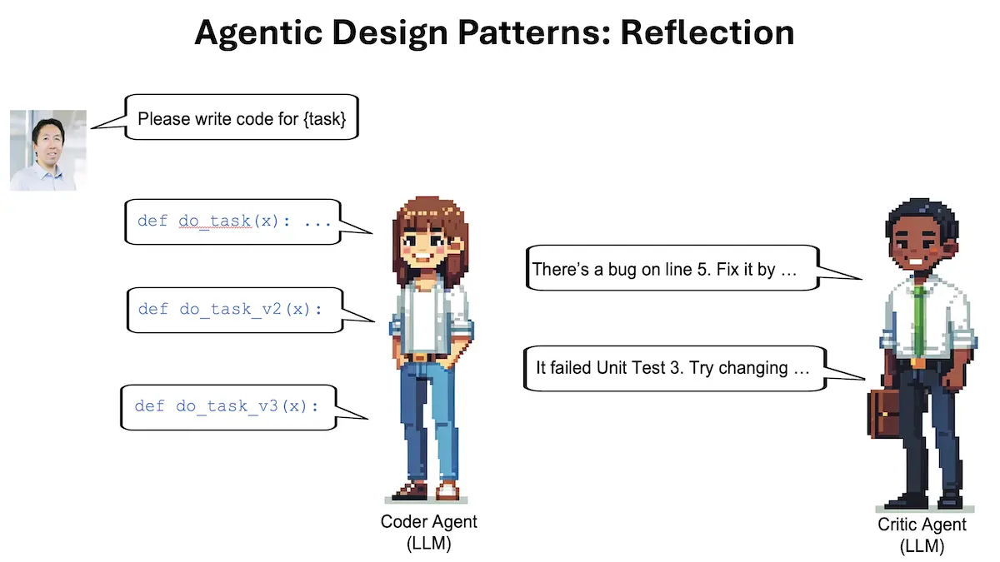

[![Deeplearning.AI](https://img.shields.io/badge/DeepLearning.AI-Article-red.svg?logo=data:image/svg+xml;base64,PHN2ZyB4bWxucz0iaHR0cDovL3d3dy53My5vcmcvMjAwMC9zdmciIGlkPSJMYXllcl8xIiBkYXRhLW5hbWU9IkxheWVyIDEiIHZpZXdCb3g9IjAgMCAzMzIuOCAzMzEuNzQiPg0KICAgIDxkZWZzIHhtbG5zPSJodHRwOi8vd3d3LnczLm9yZy8yMDAwL3N2ZyI+PHN0eWxlPi5jbHMtMXtmaWxsOiNmNWY1ZjU7ZmlsbC1ydWxlOmV2ZW5vZGQ7fTwvc3R5bGU+PC9kZWZzPg0KICAgIDxwYXRoIGNsYXNzPSJjbHMtMSIgZD0iTTE1My41IDE2MkMxOTAuMjI3IDE2MiAyMjAgMTMyLjIyNyAyMjAgOTUuNUMyMjAgNTguNzczMSAxOTAuMjI3IDI5IDE1My41IDI5QzExNi43NzMgMjkgODcgNTguNzczMSA4NyA5NS41Qzg3IDEzMi4yMjcgMTE2Ljc3MyAxNjIgMTUzLjUgMTYyWk0xNTMgMTA0QzE3MS43NzggMTA0IDE4NyA4OC43Nzc3IDE4NyA3MEMxODcgNTEuMjIyMyAxNzEuNzc4IDM2IDE1MyAzNkMxMzQuMjIyIDM2IDExOSA1MS4yMjIzIDExOSA3MEMxMTkgODguNzc3NyAxMzQuMjIyIDEwNCAxNTMgMTA0WiIgZmlsbD0iI0ZGNEE2MSIvPg0KICAgIDxwYXRoIGNsYXNzPSJjbHMtMSIgZD0iTTI1NSAxMTYuNUMyNTUgMTcyLjU1NyAyMDkuNTU3IDIxOCAxNTMuNSAyMThDOTcuNDQzMSAyMTggNTIgMTcyLjU1NyA1MiAxMTYuNUM1MiA2MC40NDMxIDk3LjQ0MzEgMTUgMTUzLjUgMTVDMjA5LjU1NyAxNSAyNTUgNjAuNDQzMSAyNTUgMTE2LjVaTTIzMCAxMDAuNUMyMzAgMTQyLjc1IDE5NS43NSAxNzcgMTUzLjUgMTc3QzExMS4yNSAxNzcgNzcgMTQyLjc1IDc3IDEwMC41Qzc3IDU4LjI1MDIgMTExLjI1IDI0IDE1My41IDI0QzE5NS43NSAyNCAyMzAgNTguMjUwMiAyMzAgMTAwLjVaIiBmaWxsPSIjRkY0QTYxIi8+DQogICAgPHBhdGggY2xhc3M9ImNscy0xIiBkPSJNMTUzIDMwNkMyMzcuNSAzMDYgMzA2IDIzNy41IDMwNiAxNTNDMzA2IDY4LjUwMDQgMjM3LjUgMCAxNTMgMEM2OC41MDA0IDAgMCA2OC41MDA0IDAgMTUzQzAgMjM3LjUgNjguNTAwNCAzMDYgMTUzIDMwNlpNMTUzIDI0NkMyMTguMTcgMjQ2IDI3MSAxOTMuMTcgMjcxIDEyOEMyNzEgNjIuODMwNCAyMTguMTcgMTAgMTUzIDEwQzg3LjgzMDQgMTAgMzUgNjIuODMwNCAzNSAxMjhDMzUgMTkzLjE3IDg3LjgzMDQgMjQ2IDE1MyAyNDZaIiBmaWxsPSIjRkY0QTYxIi8+DQo8L3N2Zz4=)](https://www.deeplearning.ai/the-batch/agentic-design-patterns-part-2-reflection/)

# Agentic Design Patterns Part 2, Reflection

친애하는 친구들에게,

지난 주에는 올해 큰 진전을 이끌 디자인 패턴 네 가지인 Reflection, Tool Use, Planning 및 Multi-agent collaboration에 대해 설명했습니다. LLM이 최종 출력을 직접 생성하는 대신, 에이전트 워크플로는 LLM을 여러 번 프롬프트하여 단계별로 더 높은 품질의 출력을 생성할 수 있는 기회를 줍니다. 이번 편지에서는 반성(Reflection)에 대해 논의하고자 합니다. 구현이 비교적 빠른 디자인 패턴임에도 불구하고, 상당한 성능 향상을 가져온 것을 보았습니다.

여러분은 ChatGPT/Claude/Gemini를 프롬프트하고 만족스럽지 않은 출력을 받은 후, LLM의 응답을 개선하기 위해 비판적인 피드백을 제공하고, 더 나은 응답을 받는 경험을 했을 것입니다. 이 비판적 피드백 제공 단계를 자동화하여 모델이 스스로 출력을 비판하고 개선하게 만들면 어떨까요? 이것이 반성의 핵심입니다.

LLM에게 코드를 작성하도록 요청하는 작업을 예로 들어봅시다. 원하는 작업 X를 수행하기 위해 필요한 코드를 직접 생성하도록 프롬프트할 수 있습니다. 그런 다음, LLM에게 자신의 출력을 검토하도록 다음과 같이 프롬프트할 수 있습니다:

*Here’s code intended for task X: [previously generated code]    
Check the code carefully for correctness, style, and efficiency, and give constructive criticism for how to improve it.*

때로는 이렇게 하면 LLM이 문제를 발견하고 건설적인 제안을 내놓을 수 있습니다. 다음으로, (i) 이전에 생성된 코드와 건설적 피드백을 포함한 컨텍스트와 (ii) 피드백을 사용하여 코드를 다시 작성하도록 요청하는 프롬프트를 제공합니다. 이렇게 하면 더 나은 응답을 얻을 수 있습니다. 비판/재작성 과정을 반복하면 추가적인 개선이 이루어질 수 있습니다. 이러한 자기 반성 과정은 코드 작성, 텍스트 작성, 질문에 대한 답변 등 다양한 작업에서 LLM이 갭을 발견하고 출력을 개선할 수 있게 해줍니다.

또한, 우리는 LLM에게 출력을 평가하는 데 도움이 되는 도구를 제공하여 자기 반성 과정을 넘어설 수 있습니다. 예를 들어, 코드를 실행하여 테스트 케이스에서 올바른 결과를 생성하는지 확인하는 유닛 테스트를 수행하거나 텍스트 출력을 이중 확인하기 위해 웹 검색을 하는 등의 도구를 제공할 수 있습니다. 그런 다음 발견된 오류를 반성하고 개선 아이디어를 내놓을 수 있습니다.

더 나아가, 다중 에이전트 프레임워크를 사용하여 반성을 구현할 수 있습니다. 저는 좋은 출력을 생성하도록 프롬프트된 하나의 에이전트와 첫 번째 에이전트의 출력을 비판적으로 검토하도록 프롬프트된 다른 에이전트를 만들어 사용하는 것이 편리하다는 것을 발견했습니다. 두 에이전트 간의 토론은 향상된 응답을 가져옵니다.

반성은 비교적 기본적인 유형의 에이전트 워크플로이지만, 몇 가지 경우에서 애플리케이션의 결과를 크게 개선하는 것을 보았습니다. 여러분이 자신의 작업에서 시도해 보기를 바랍니다. 반성에 대해 더 알고 싶다면 다음 논문들을 추천합니다:

* [Self-Refine: Iterative Refinement with Self-Feedback](../asset/self_refine_iterative_refinement_with_self_feedback.pdf), Madaan et al. (2023)
* [Reflexion: Language Agents with Verbal Reinforcement Learning](../asset/reflexion_language_agents_with_verbal_reinforcement_learning.pdf), Shinn et al. (2023)
* [CRITIC: Large Language Models Can Self-Correct with Tool-Interactive Critiquing](../asset/critic_large_language_models_can_self_correct_with_tool_interactive_critiquing.pdf), Gou et al. (2024)

다른 에이전트 디자인 패턴에 대해서는 다음 편지에서 다루겠습니다.

계속해서 배워나가세요!