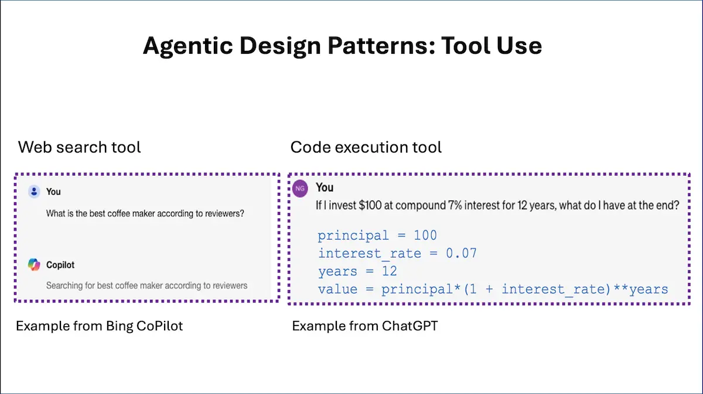

[![Deeplearning.AI](https://img.shields.io/badge/DeepLearning.AI-Article-red.svg?logo=data:image/svg+xml;base64,PHN2ZyB4bWxucz0iaHR0cDovL3d3dy53My5vcmcvMjAwMC9zdmciIGlkPSJMYXllcl8xIiBkYXRhLW5hbWU9IkxheWVyIDEiIHZpZXdCb3g9IjAgMCAzMzIuOCAzMzEuNzQiPg0KICAgIDxkZWZzIHhtbG5zPSJodHRwOi8vd3d3LnczLm9yZy8yMDAwL3N2ZyI+PHN0eWxlPi5jbHMtMXtmaWxsOiNmNWY1ZjU7ZmlsbC1ydWxlOmV2ZW5vZGQ7fTwvc3R5bGU+PC9kZWZzPg0KICAgIDxwYXRoIGNsYXNzPSJjbHMtMSIgZD0iTTE1My41IDE2MkMxOTAuMjI3IDE2MiAyMjAgMTMyLjIyNyAyMjAgOTUuNUMyMjAgNTguNzczMSAxOTAuMjI3IDI5IDE1My41IDI5QzExNi43NzMgMjkgODcgNTguNzczMSA4NyA5NS41Qzg3IDEzMi4yMjcgMTE2Ljc3MyAxNjIgMTUzLjUgMTYyWk0xNTMgMTA0QzE3MS43NzggMTA0IDE4NyA4OC43Nzc3IDE4NyA3MEMxODcgNTEuMjIyMyAxNzEuNzc4IDM2IDE1MyAzNkMxMzQuMjIyIDM2IDExOSA1MS4yMjIzIDExOSA3MEMxMTkgODguNzc3NyAxMzQuMjIyIDEwNCAxNTMgMTA0WiIgZmlsbD0iI0ZGNEE2MSIvPg0KICAgIDxwYXRoIGNsYXNzPSJjbHMtMSIgZD0iTTI1NSAxMTYuNUMyNTUgMTcyLjU1NyAyMDkuNTU3IDIxOCAxNTMuNSAyMThDOTcuNDQzMSAyMTggNTIgMTcyLjU1NyA1MiAxMTYuNUM1MiA2MC40NDMxIDk3LjQ0MzEgMTUgMTUzLjUgMTVDMjA5LjU1NyAxNSAyNTUgNjAuNDQzMSAyNTUgMTE2LjVaTTIzMCAxMDAuNUMyMzAgMTQyLjc1IDE5NS43NSAxNzcgMTUzLjUgMTc3QzExMS4yNSAxNzcgNzcgMTQyLjc1IDc3IDEwMC41Qzc3IDU4LjI1MDIgMTExLjI1IDI0IDE1My41IDI0QzE5NS43NSAyNCAyMzAgNTguMjUwMiAyMzAgMTAwLjVaIiBmaWxsPSIjRkY0QTYxIi8+DQogICAgPHBhdGggY2xhc3M9ImNscy0xIiBkPSJNMTUzIDMwNkMyMzcuNSAzMDYgMzA2IDIzNy41IDMwNiAxNTNDMzA2IDY4LjUwMDQgMjM3LjUgMCAxNTMgMEM2OC41MDA0IDAgMCA2OC41MDA0IDAgMTUzQzAgMjM3LjUgNjguNTAwNCAzMDYgMTUzIDMwNlpNMTUzIDI0NkMyMTguMTcgMjQ2IDI3MSAxOTMuMTcgMjcxIDEyOEMyNzEgNjIuODMwNCAyMTguMTcgMTAgMTUzIDEwQzg3LjgzMDQgMTAgMzUgNjIuODMwNCAzNSAxMjhDMzUgMTkzLjE3IDg3LjgzMDQgMjQ2IDE1MyAyNDZaIiBmaWxsPSIjRkY0QTYxIi8+DQo8L3N2Zz4=)](https://www.deeplearning.ai/the-batch/agentic-design-patterns-part-3-tool-use/)


# Agentic Design Patterns Part 3, Tool Use

친애하는 친구들에게,

도구 사용(Tool Use)은 정보 수집, 행동 수행 또는 데이터 조작을 위해 요청할 수 있는 함수가 제공되는 LLM의 주요 디자인 패턴 중 하나입니다. 웹 검색이나 코드 실행을 수행할 수 있는 LLM 기반 시스템을 익히 알고 계실 것입니다. 사실, 일부 대형 소비자 대상 LLM은 이미 이러한 기능을 통합하고 있습니다. 그러나 도구 사용은 이러한 예시를 훨씬 뛰어넘습니다.

예를 들어, 온라인 LLM 기반 채팅 시스템에 "리뷰에 따르면 최고의 커피 메이커는 무엇인가요?"라고 물어보면, 웹 검색을 수행하여 하나 이상의 웹 페이지를 다운로드하여 맥락을 파악하려고 할 수 있습니다. 초기에는 미리 학습된 transformer만으로 출력 토큰을 생성하는 데 의존하는 것이 한계가 있다는 것을 LLM 개발자들이 깨달았습니다. 그래서 LLM에 웹 검색 도구를 제공함으로써 훨씬 더 많은 일을 할 수 있게 되었습니다. 이러한 도구를 사용하면 LLM은 특수한 문자열({tool: web-search, query: "coffee maker reviews"})을 생성하여 검색 엔진 호출을 요청할 수 있습니다. 후처리 단계에서는 이러한 문자열을 찾아 해당 매개변수로 웹 검색 기능을 호출하고, 결과를 추가 입력 컨텍스트로 LLM에 전달하여 추가 처리를 수행할 수 있습니다.

마찬가지로 "100달러를 연 이율 7%로 12년 동안 복리로 투자하면 얼마가 될까요?"라고 물어보면, transformer 네트워크를 사용하여 직접 답을 생성하려 하기보다는 코드 실행 도구를 사용하여 `100 * (1+0.07)**12`를 계산하도록 할 수 있습니다. LLM은 
```
{tool: python-interpreter, code: "100 * (1+0.07)\**12"}
```
와 같은 문자열을 생성할 수 있습니다.



하지만 요즘 에이전트 워크플로에서 도구 사용은 훨씬 더 나아갑니다. 개발자들은 다양한 출처(웹, Wikipedia, arXiv 등)를 검색하고, 생산성 도구와 인터페이스하며(이메일 보내기, 캘린더 항목 읽기/쓰기 등), 이미지 생성 또는 해석 등 다양한 기능을 사용하고 있습니다. 많은 함수에 대한 상세한 설명을 제공하는 컨텍스트를 사용하여 LLM을 프롬프트할 수 있습니다. 이러한 설명에는 함수가 하는 일과 함수가 기대하는 매개변수에 대한 세부 정보가 포함될 수 있습니다. 그리고 우리는 LLM이 작업을 수행하기 위해 적절한 함수를 자동으로 선택할 것으로 기대합니다. 또한, 시스템은 수백 개의 도구에 접근할 수 있도록 구축되고 있습니다. 이러한 상황에서는 모든 함수를 LLM 컨텍스트에 포함시키기에 너무 많을 수 있으므로, 현재 처리 단계에서 LLM 컨텍스트에 포함할 가장 관련성이 높은 하위 집합을 선택하기 위해 휴리스틱을 사용할 수 있습니다. 이 기술은 아래 인용된 Gorilla 논문에 설명되어 있으며, 포함할 텍스트가 너무 많을 때 하위 집합을 선택하는 방법을 제공하는 검색 보강 생성(RAG) 시스템과 유사합니다.

LLM 초기 역사에서는 LLaVa, GPT-4V 및 Gemini와 같은 대규모 멀티모달 모델(LMM)이 널리 사용되기 전까지 이미지를 직접 처리할 수 없었기 때문에 도구 사용에 대한 많은 연구가 컴퓨터 비전 커뮤니티에서 이루어졌습니다. 당시 LLM 기반 시스템이 이미지를 조작하는 유일한 방법은 예를 들어 객체 인식 또는 기타 기능을 수행하기 위해 함수를 호출하는 것이었습니다. 그 이후로 도구 사용 관행이 폭발적으로 증가했습니다. 작년 중반에 출시된 GPT-4의 함수 호출 기능은 범용 구현을 향한 중요한 단계였습니다. 그 이후로 더 많은 LLM이 도구 사용에 능숙하게 개발되고 있습니다.

도구 사용에 대해 더 알고 싶다면 다음 논문들을 추천합니다:

* “Gorilla: Large Language Model Connected with Massive APIs,” Patil et al. (2023)
* “MM-REACT: Prompting ChatGPT for Multimodal Reasoning and Action,” Yang et al. (2023)
* “Efficient Tool Use with Chain-of-Abstraction Reasoning,” Gao et al. (2024)

지난주 편지에서 설명한 반성(Reflection)과 도구 사용 모두 제 애플리케이션에서 신뢰할 수 있게 작동하는 디자인 패턴입니다. 이 두 가지 기능은 충분히 배울 가치가 있습니다. 다음 편지에서는 계획 및 다중 에이전트 협업 디자인 패턴에 대해 설명하겠습니다. 이들은 AI 에이전트가 훨씬 더 많은 일을 할 수 있게 해주지만, 아직 성숙하지 않고 예측할 수 없는 기술입니다.

