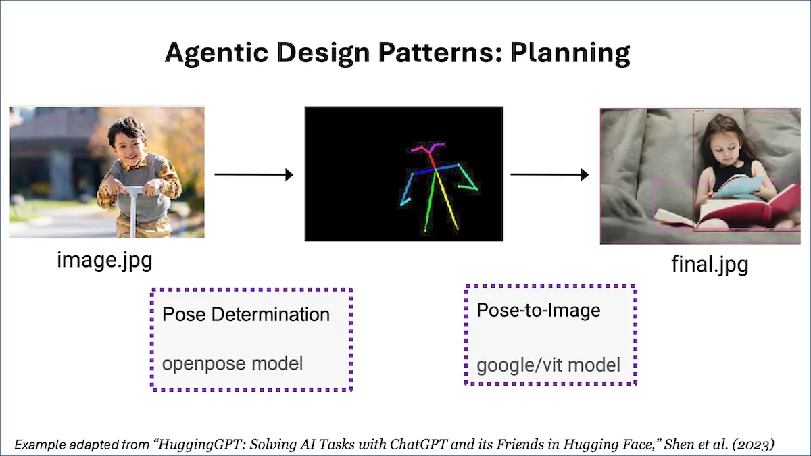

[![Deeplearning.AI](https://img.shields.io/badge/DeepLearning.AI-Article-red.svg?logo=data:image/svg+xml;base64,PHN2ZyB4bWxucz0iaHR0cDovL3d3dy53My5vcmcvMjAwMC9zdmciIGlkPSJMYXllcl8xIiBkYXRhLW5hbWU9IkxheWVyIDEiIHZpZXdCb3g9IjAgMCAzMzIuOCAzMzEuNzQiPg0KICAgIDxkZWZzIHhtbG5zPSJodHRwOi8vd3d3LnczLm9yZy8yMDAwL3N2ZyI+PHN0eWxlPi5jbHMtMXtmaWxsOiNmNWY1ZjU7ZmlsbC1ydWxlOmV2ZW5vZGQ7fTwvc3R5bGU+PC9kZWZzPg0KICAgIDxwYXRoIGNsYXNzPSJjbHMtMSIgZD0iTTE1My41IDE2MkMxOTAuMjI3IDE2MiAyMjAgMTMyLjIyNyAyMjAgOTUuNUMyMjAgNTguNzczMSAxOTAuMjI3IDI5IDE1My41IDI5QzExNi43NzMgMjkgODcgNTguNzczMSA4NyA5NS41Qzg3IDEzMi4yMjcgMTE2Ljc3MyAxNjIgMTUzLjUgMTYyWk0xNTMgMTA0QzE3MS43NzggMTA0IDE4NyA4OC43Nzc3IDE4NyA3MEMxODcgNTEuMjIyMyAxNzEuNzc4IDM2IDE1MyAzNkMxMzQuMjIyIDM2IDExOSA1MS4yMjIzIDExOSA3MEMxMTkgODguNzc3NyAxMzQuMjIyIDEwNCAxNTMgMTA0WiIgZmlsbD0iI0ZGNEE2MSIvPg0KICAgIDxwYXRoIGNsYXNzPSJjbHMtMSIgZD0iTTI1NSAxMTYuNUMyNTUgMTcyLjU1NyAyMDkuNTU3IDIxOCAxNTMuNSAyMThDOTcuNDQzMSAyMTggNTIgMTcyLjU1NyA1MiAxMTYuNUM1MiA2MC40NDMxIDk3LjQ0MzEgMTUgMTUzLjUgMTVDMjA5LjU1NyAxNSAyNTUgNjAuNDQzMSAyNTUgMTE2LjVaTTIzMCAxMDAuNUMyMzAgMTQyLjc1IDE5NS43NSAxNzcgMTUzLjUgMTc3QzExMS4yNSAxNzcgNzcgMTQyLjc1IDc3IDEwMC41Qzc3IDU4LjI1MDIgMTExLjI1IDI0IDE1My41IDI0QzE5NS43NSAyNCAyMzAgNTguMjUwMiAyMzAgMTAwLjVaIiBmaWxsPSIjRkY0QTYxIi8+DQogICAgPHBhdGggY2xhc3M9ImNscy0xIiBkPSJNMTUzIDMwNkMyMzcuNSAzMDYgMzA2IDIzNy41IDMwNiAxNTNDMzA2IDY4LjUwMDQgMjM3LjUgMCAxNTMgMEM2OC41MDA0IDAgMCA2OC41MDA0IDAgMTUzQzAgMjM3LjUgNjguNTAwNCAzMDYgMTUzIDMwNlpNMTUzIDI0NkMyMTguMTcgMjQ2IDI3MSAxOTMuMTcgMjcxIDEyOEMyNzEgNjIuODMwNCAyMTguMTcgMTAgMTUzIDEwQzg3LjgzMDQgMTAgMzUgNjIuODMwNCAzNSAxMjhDMzUgMTkzLjE3IDg3LjgzMDQgMjQ2IDE1MyAyNDZaIiBmaWxsPSIjRkY0QTYxIi8+DQo8L3N2Zz4=)](https://www.deeplearning.ai/the-batch/agentic-design-patterns-part-4-planning/)


# Agentic Design Patterns Part 4, Planning

친애하는 친구들에게,

계획(Planning)은 에이전트 AI의 주요 디자인 패턴으로, 대형 언어 모델(LLM)을 사용하여 더 큰 작업을 수행하기 위해 실행할 일련의 단계를 자율적으로 결정하는 것입니다. 예를 들어, 에이전트에게 특정 주제에 대한 온라인 조사를 요청하면, LLM은 이를 특정 하위 주제 조사, 연구 결과 통합, 보고서 작성 등의 더 작은 하위 작업으로 분해할 수 있습니다.

많은 사람들은 ChatGPT가 출시된 직후에 ChatGPT를 사용해보고 AI가 할 수 있는 일에 대한 기대를 뛰어넘는 것을 보고 놀랐던 "ChatGPT moment"을 경험했습니다. 비슷한 "AI Agentic moment"을 아직 경험하지 못했다면, 곧 그런 순간을 경험하게 되기를 바랍니다. 저는 몇 달 전에 다양한 온라인 검색 도구에 접근할 수 있는 연구 에이전트를 구현하고 실시간 데모를 진행하면서 그러한 순간을 경험했습니다.

이 에이전트를 여러 번 개인적으로 테스트했을 때, 일관되게 웹 검색 도구를 사용하여 정보를 수집하고 요약을 작성했습니다. 하지만 실시간 데모 중에 웹 검색 API가 예기치 않게 속도 제한 오류를 반환했습니다. 저는 공개적으로 데모가 실패할 것이라고 생각하고 두려움에 빠졌습니다. 그러나 놀랍게도 에이전트는 제가 제공한 것을 잊어버린 Wikipedia 검색 도구로 전환하여 웹 검색 대신 Wikipedia를 사용하여 작업을 완료했습니다.

이것이 저에게 AI 에이전트 순간의 놀라움이었습니다. 아직 이러한 순간을 경험하지 않은 많은 사람들은 앞으로 몇 달 안에 그러한 순간을 경험하게 될 것입니다. 에이전트가 예상치 못한 방식으로 일을 자율적으로 결정하고 성공하는 것을 보는 것은 아름다운 일입니다!

많은 작업은 단일 단계나 단일 도구 호출로 수행할 수 없지만, 에이전트는 어떤 단계를 취할지 결정할 수 있습니다. 예를 들어, HuggingGPT 논문에서 단순화된 예시를 들자면, 소년의 사진을 고려하고 동일한 포즈의 소녀의 사진을 그리는 작업을 에이전트에게 요청하면, 작업은 두 가지 단계로 분해될 수 있습니다: 
1. 소년의 사진에서 포즈를 감지하고 
2. 감지된 포즈에서 소녀의 사진을 렌더링합니다. 
 
LLM은 다음과 같은 문자열을 출력하여 계획을 지정하도록 미세 조정되거나 프롬프트될 수 있습니다: 
```
{tool: pose-detection, input: image.jpg, output: temp1}
{tool: pose-to-image, input: temp1, output: final.jpg}.
```



이 구조화된 출력은 두 단계를 지정하며, 소프트웨어가 포즈 감지 도구를 호출한 후 포즈 이미지 도구를 호출하여 작업을 완료하도록 트리거합니다. (이 예시는 설명을 위한 것이며, HuggingGPT는 다른 형식을 사용합니다.)

솔직히 말해서, 많은 에이전트 워크플로는 계획을 필요로 하지 않습니다. 예를 들어, 에이전트가 출력에 대해 반성하고 개선하는 작업을 고정된 횟수로 반복하는 경우, 에이전트가 수행하는 순서는 고정적이고 결정론적입니다. 그러나 미리 작업을 단계별로 분해할 수 없는 복잡한 작업의 경우, 계획을 통해 에이전트가 동적으로 어떤 단계를 취할지 결정할 수 있습니다.

한편으로, 계획은 매우 강력한 기능입니다. 다른 한편으로는 예측할 수 없는 결과를 초래합니다. 제 경험상, 반성(Reflection)과 도구 사용(Tool Use)과 같은 에이전트 디자인 패턴이 신뢰할 수 있게 작동하고 애플리케이션의 성능을 개선하는 반면, 계획은 덜 성숙한 기술이며, 사전에 무엇을 할지 예측하기 어렵습니다. 하지만 이 분야는 빠르게 진화하고 있으며, 계획 능력이 빠르게 개선될 것이라고 확신합니다.

LLM과의 계획에 대해 더 알고 싶다면 다음 논문들을 추천합니다:

* “Chain-of-Thought Prompting Elicits Reasoning in Large Language Models,” Wei et al. (2022)
* “HuggingGPT: Solving AI Tasks with ChatGPT and its Friends in Hugging Face,” Shen et al. (2023)
* “Understanding the planning of LLM agents: A survey,” by Huang et al. (2024)

계속해서 배워나가세요!
