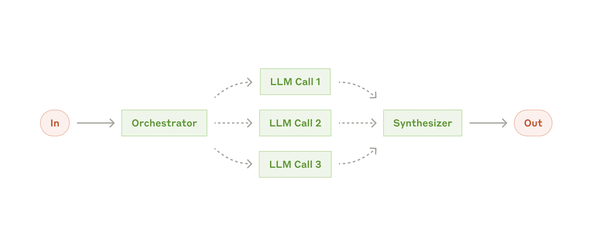

> 원문: https://www.anthropic.com/research/building-effective-agents

**효과적인 에이전트 구축**

2024년 12월 20일 게시

지난 1년 동안, 우리는 다양한 산업 분야에서 대형 언어 모델(LLM) 에이전트를 구축하는 팀과 협력했습니다. 꾸준히, 가장 성공적인 구현은 복잡한 프레임워크나 전문 라이브러리를 사용하지 않고, 대신 간단하고 구성 가능한 패턴을 사용하고 있었습니다.

이 게시물에서는 고객과 협력하고 에이전트를 구축하면서 배운 점을 공유하고, 개발자들이 효과적인 에이전트를 구축할 수 있도록 실용적인 조언을 제공합니다.

**에이전트란 무엇인가요?**

"에이전트"는 여러 가지로 정의될 수 있습니다. 일부 고객은 에이전트를 다양한 도구를 사용하여 복잡한 작업을 수행하는 완전 자율 시스템으로 정의합니다. 다른 고객은 사전 정의된 워크플로우를 따르는 보다 규정적인 구현을 의미합니다. Anthropic에서는 이러한 변형을 모두 에이전트 시스템으로 분류하지만, 워크플로우와 에이전트 간의 중요한 건축적 차이를 둡니다.

**워크플로우와 에이전트의 차이**

- 워크플로우: LLM과 도구가 사전 정의된 코드 경로를 통해 오케스트레이션되는 시스템.
- 에이전트: LLM이 자신의 프로세스와 도구 사용을 동적으로 제어하며 작업을 수행하는 시스템.

**언제 에이전트를 사용해야 하나요?**

LLM을 활용한 애플리케이션을 구축할 때, 가능한 한 간단한 해결책을 찾고 필요할 때만 복잡성을 높이는 것이 좋습니다. 때로는 에이전트 시스템을 전혀 구축하지 않는 것이 좋을 수도 있습니다. 에이전트 시스템은 종종 지연 시간과 비용을 희생하여 더 나은 작업 성능을 제공합니다. 워크플로우는 잘 정의된 작업에 대해 예측 가능성과 일관성을 제공하고, 에이전트는 유연성과 모델 기반 의사 결정을 필요로 할 때 더 나은 선택입니다.

추가적으로 특정 작업에서 에이전트가 어떤 가치를 추가하는지와 예제를 제공합니다.

**에이전트를 언제 사용하고 언제 사용하지 말아야 하는가**

LLM을 사용하여 애플리케이션을 구축할 때는 가능한 한 간단한 해결책을 찾고, 필요할 때만 복잡성을 높이는 것이 좋습니다. 이는 전혀 에이전트 시스템을 구축하지 않는 것을 의미할 수도 있습니다. 에이전트 시스템은 종종 지연 시간과 비용을 희생하여 더 나은 작업 성능을 제공합니다. 이 교환이 언제 의미가 있는지 고려해야 합니다. 더 복잡한 작업이 필요할 때, 워크플로우는 잘 정의된 작업에 대해 예측 가능성과 일관성을 제공하고, 에이전트는 대규모로 유연성과 모델 기반 의사 결정을 필요로 할 때 더 나은 선택입니다. 그러나 많은 애플리케이션에서는 검색과 컨텍스트 예제를 통한 단일 LLM 호출을 최적화하는 것으로 충분합니다.

**프레임워크를 언제 그리고 어떻게 사용할 것인가**

에이전트 시스템 구현을 쉽게 만드는 많은 프레임워크가 있습니다. 예를 들어 LangChain의 LangGraph, Amazon Bedrock의 AI Agent 프레임워크, GUI LLM 워크플로우 빌더인 Rivet, 그리고 복잡한 워크플로우를 구축하고 테스트하는 또 다른 GUI 도구인 Vellum 등이 있습니다. 이러한 프레임워크는 표준 저수준 작업(LLM 호출, 도구 정의 및 구문 분석, 호출 연결 등)을 단순화하여 쉽게 시작할 수 있게 합니다. 그러나 종종 추가적인 추상화 계층을 만들어 기본 프롬프트와 응답을 불투명하게 하여 디버깅을 더 어렵게 만들 수 있습니다. 또한, 더 간단한 설정이 충분한 경우에도 복잡성을 추가하고 싶은 유혹에 빠질 수 있습니다.

개발자들은 LLM API를 직접 사용하는 것부터 시작하는 것을 권장합니다. 많은 패턴은 몇 줄의 코드로 구현될 수 있습니다. 프레임워크를 사용하는 경우, 기본 코드를 이해해야 합니다. 내부 구조에 대한 잘못된 가정은 일반적인 고객 오류의 원인입니다.

일부 샘플 구현은 우리의 요리책에서 확인할 수 있습니다.

**구성 요소, 워크플로우 및 에이전트**

이 섹션에서는 우리가 실제로 본 에이전트 시스템의 일반적인 패턴을 탐구할 것입니다. 기본 구성 요소인 증강 LLM부터 시작하여 단순한 구성 워크플로우에서 자율 에이전트로 복잡성을 점차 증가시킬 것입니다.

**구성 요소: 증강 LLM**

에이전트 시스템의 기본 구성 요소는 검색, 도구 및 메모리와 같은 기능이 추가된 LLM입니다. 현재 모델은 이러한 기능을 적극적으로 사용할 수 있으며, 자체 검색 쿼리를 생성하고 적절한 도구를 선택하며 유지할 정보를 결정할 수 있습니다.

우리는 이러한 기능을 특정 사용 사례에 맞추고 LLM에 대한 쉬운 문서화된 인터페이스를 제공하는 두 가지 주요 측면에 집중할 것을 권장합니다. 이러한 증강 기능을 구현하는 방법은 여러 가지가 있지만, 최근 출시된 모델 컨텍스트 프로토콜을 통해 간단한 클라이언트 구현으로 서드파티 도구 생태계와 통합할 수 있습니다.

이 게시물의 나머지 부분에서는 각 LLM 호출이 이러한 증강 기능에 액세스할 수 있다고 가정합니다.

**워크플로우: 프롬프트 체이닝**

프롬프트 체이닝은 작업을 일련의 단계로 분해하여 각 LLM 호출이 이전 호출의 출력을 처리하는 방식입니다. 각 중간 단계에 대해 프로그래밍 검사를 추가하여 프로세스가 여전히 올바른지 확인할 수 있습니다.

이 워크플로우를 사용할 때:
- 작업을 고정된 하위 작업으로 쉽게 분해할 수 있는 상황에서 이상적입니다.
- 각 LLM 호출을 더 쉬운 작업으로 만들어 지연 시간을 희생하여 더 높은 정확도를 얻는 것이 주요 목표입니다.

**프롬프트 체이닝이 유용한 예:**
- 마케팅 카피 생성 후 다른 언어로 번역하기
- 문서 개요 작성, 개요가 특정 기준을 충족하는지 확인한 후 개요를 바탕으로 문서 작성

**워크플로우: 라우팅**

라우팅은 입력을 분류하고 이를 전문화된 후속 작업으로 전달합니다. 이 워크플로우는 관심사의 분리를 가능하게 하며, 더 전문화된 프롬프트를 구성할 수 있게 합니다. 이 워크플로우가 없으면 특정 유형의 입력을 최적화하는 것이 다른 입력의 성능에 해로울 수 있습니다.

이 워크플로우를 사용할 때:
- 라우팅은 개별적으로 처리하는 것이 더 나은 명확한 카테고리가 있는 복잡한 작업에 잘 작동합니다.
- 분류가 LLM 또는 전통적인 분류 모델/알고리즘에 의해 정확하게 처리될 수 있는 경우에 유용합니다.

**라우팅이 유용한 예:**
- 다양한 유형의 고객 서비스 문의(일반 질문, 환불 요청, 기술 지원)를 서로 다른 하위 프로세스, 프롬프트 및 도구로 전달합니다.
- 쉬운/일반적인 질문을 Claude 3.5 Haiku와 같은 작은 모델로 라우팅하고, 어려운/비정상적인 질문을 Claude 3.5 Sonnet과 같은 더 강력한 모델로 라우팅하여 비용과 속도를 최적화합니다.

**Workflow: Parallelization**

LLM은 때때로 작업을 동시에 처리하고, 그 출력을 프로그래밍 방식으로 집계할 수 있습니다. 이 워크플로우인 병렬화는 두 가지 주요 변형으로 나타납니다:

**분할(Sectioning)**: 작업을 독립적인 하위 작업으로 나누어 병렬로 실행합니다.
**투표(Voting)**: 동일한 작업을 여러 번 실행하여 다양한 출력을 얻습니다.

이 워크플로우를 사용할 때:
- 분할된 하위 작업을 병렬화하여 속도를 높이거나, 더 높은 신뢰도 있는 결과를 얻기 위해 여러 관점이나 시도가 필요할 때 병렬화가 효과적입니다.
- 여러 고려 사항이 있는 복잡한 작업의 경우, 각 고려 사항을 별도의 LLM 호출로 처리할 때 일반적으로 더 나은 성능을 발휘합니다. 이는 각 특정 측면에 집중할 수 있게 합니다.

**병렬화가 유용한 예:**

**분할(Sectioning)**
- 하나의 모델 인스턴스가 사용자 쿼리를 처리하는 동안, 다른 인스턴스가 부적절한 콘텐츠나 요청을 차단합니다. 이는 동일한 LLM 호출이 두 가지 작업을 모두 처리하는 것보다 더 나은 성능을 발휘합니다.
- LLM 성능 평가 자동화, 각 LLM 호출이 주어진 프롬프트에서 모델의 성능의 다른 측면을 평가합니다.

**투표(Voting)**
- 코드 취약성을 검토하는 경우, 여러 다른 프롬프트가 코드를 검토하고 문제가 있으면 코드를 표시합니다.
- 특정 콘텐츠가 부적절한지 평가하는 경우, 여러 프롬프트가 다른 측면을 평가하거나 허위 긍정 및 허위 부정을 균형 있게 조정하기 위해 다양한 투표 임계값을 요구합니다.

**Workflow: Orchestrator-workers**

오케스트레이터-워커 워크플로우에서는 중앙 LLM이 동적으로 작업을 분할하고, 이를 워커 LLM에 위임하며 결과를 종합합니다.

이 워크플로우를 사용할 때:
- 이 워크플로우는 필요한 하위 작업을 예측할 수 없는 복잡한 작업에 적합합니다. (예를 들어, 코딩에서는 변경해야 할 파일의 수와 각 파일의 변경 사항이 작업에 따라 달라질 수 있습니다.)
- 병렬화와의 주요 차이점은 유연성입니다. 하위 작업이 사전에 정의되지 않고 특정 입력에 따라 오케스트레이터에 의해 결정됩니다.

**오케스트레이터-워커가 유용한 예:**
- 여러 파일에 복잡한 변경을 가하는 코딩 작업.
- 여러 소스에서 정보를 수집하고 분석하여 관련 정보를 찾는 검색 작업.

**Workflow: Evaluator-optimizer**

평가자-최적화자 워크플로우에서는 한 LLM 호출이 응답을 생성하고, 다른 LLM이 평가와 피드백을 반복적으로 제공하는 구조입니다.

이 워크플로우를 사용할 때:
- 명확한 평가 기준이 있고, 반복적인 개선이 측정 가능한 가치를 제공할 때 이 워크플로우가 특히 효과적입니다.
- LLM 응답이 사람이 피드백을 제공할 때 눈에 띄게 개선될 수 있으며, LLM이 그러한 피드백을 제공할 수 있다는 두 가지 조건이 잘 맞는지 확인할 수 있습니다. 이는 인간 작가가 완성된 문서를 작성할 때 겪는 반복적인 글쓰기 과정과 유사합니다.

**평가자-최적화자가 유용한 예:**
- 문학 번역: 번역 LLM이 처음에는 포착하지 못할 수 있는 뉘앙스를 평가 LLM이 유용하게 비판할 수 있는 경우.
- 복잡한 검색 작업: 포괄적인 정보를 수집하기 위해 여러 번의 검색과 분석이 필요한 경우, 평가자가 추가 검색이 필요한지 여부를 결정할 수 있습니다.

**Agents**

LLM이 복잡한 입력을 이해하고, 추론 및 계획을 수행하며, 도구를 신뢰할 수 있게 사용하고, 오류를 복구하는 핵심 능력이 성숙해짐에 따라 에이전트가 실제로 등장하고 있습니다. 에이전트는 인간 사용자로부터 명령을 받거나, 상호작용을 통해 작업을 시작합니다. 작업이 명확해지면, 에이전트는 독립적으로 계획하고 운영하며, 추가 정보나 판단을 위해 인간에게 다시 돌아올 수 있습니다. 실행 중에는 각 단계에서 환경의 "사실"을 얻는 것이 중요합니다 (예: 도구 호출 결과나 코드 실행). 이를 통해 진행 상황을 평가합니다. 에이전트는 중간 중간 체크포인트에서 또는 차단 문제를 만났을 때 인간의 피드백을 받을 수 있습니다. 작업은 일반적으로 완료되면 종료되지만, 제어를 유지하기 위해 최대 반복 횟수와 같은 중지 조건을 포함하는 경우도 일반적입니다.

에이전트는 복잡한 작업을 처리할 수 있지만, 구현은 종종 간단합니다. 일반적으로 LLM이 환경 피드백을 기반으로 도구를 사용하는 루프로 구성됩니다. 따라서 도구 세트와 그 문서를 명확하고 신중하게 설계하는 것이 중요합니다. 도구 개발에 대한 모범 사례는 부록 2("프롬프트 엔지니어링 도구")에서 확장하여 다룹니다.

에이전트를 사용할 때:
- 에이전트는 필요한 단계 수를 예측할 수 없거나 고정된 경로를 하드코딩할 수 없는 열린 문제에 사용할 수 있습니다. LLM은 여러 번의 회전을 통해 작동할 가능성이 있으며, 의사 결정에 대한 신뢰가 어느 정도 필요합니다. 에이전트의 자율성은 신뢰할 수 있는 환경에서 작업을 확장하는 데 이상적입니다.

에이전트의 자율적인 특성은 더 높은 비용과 복합적인 오류의 가능성을 의미합니다. 우리는 샌드박스 환경에서 광범위한 테스트와 적절한 가드레일을 권장합니다.

**에이전트가 유용한 예:**
- 다음 예는 우리의 구현에서 가져온 것입니다:
  - 작업 설명에 따라 여러 파일을 수정하는 SWE-bench 작업을 해결하는 코딩 에이전트
  - Claude가 컴퓨터를 사용하여 작업을 수행하는 "컴퓨터 사용" 참조 구현

**이 패턴들을 결합하고 맞춤화하기**

이러한 구성 요소는 규범적이지 않습니다. 개발자들이 다양한 사용 사례에 맞게 조형하고 결합할 수 있는 일반적인 패턴입니다. LLM 기능과 마찬가지로 성능을 측정하고 구현을 반복하는 것이 성공의 열쇠입니다. 다시 말해: 복잡성을 추가하는 것은 결과가 명확히 개선될 때만 고려해야 합니다.

**요약**

LLM 분야에서 성공하는 것은 가장 정교한 시스템을 구축하는 것이 아니라, 필요한 시스템을 구축하는 것입니다. 간단한 프롬프트로 시작하여 포괄적인 평가로 최적화하고, 간단한 솔루션이 부족할 때만 다단계 에이전트 시스템을 추가하십시오.

에이전트를 구현할 때 우리는 세 가지 핵심 원칙을 따르려고 합니다:
1. 에이전트의 설계를 간단하게 유지하십시오.
2. 에이전트의 계획 단계를 명확히 보여 투명성을 우선시하십시오.
3. 철저한 도구 문서화와 테스트를 통해 에이전트-컴퓨터 인터페이스(ACI)를 신중하게 설계하십시오.

프레임워크는 빠르게 시작하는 데 도움이 될 수 있지만, 추상화 계층을 줄이고 기본 구성 요소로 구축하는 것을 주저하지 마십시오. 이러한 원칙을 따르면, 강력하면서도 신뢰할 수 있고 유지 관리가 용이한, 사용자에게 신뢰받는 에이전트를 만들 수 있습니다.

**감사의 말**

Erik Schluntz와 Barry Zhang이 작성했습니다. 이 작업은 Anthropic에서 에이전트를 구축한 경험과 고객이 공유한 귀중한 통찰력에 기반하고 있습니다. 고객들에게 깊은 감사를 드립니다.

**부록 1: 실제 에이전트**

고객과 협력한 결과, 위에서 논의한 패턴의 실용적 가치를 보여주는 두 가지 특히 유망한 AI 에이전트 응용 프로그램이 밝혀졌습니다. 이 두 응용 프로그램 모두 대화와 행동이 모두 필요한 작업, 명확한 성공 기준, 피드백 루프 활성화, 의미 있는 인간 감독 통합 등의 점에서 에이전트가 가장 큰 가치를 추가하는 방법을 보여줍니다.

**A. 고객 지원**

고객 지원은 친숙한 챗봇 인터페이스에 도구 통합을 통한 향상된 기능을 결합합니다. 이는 다음과 같은 이유로 보다 개방적인 에이전트에 자연스럽게 적합합니다:
- 지원 상호작용은 외부 정보와 작업에 대한 접근이 필요하면서 자연스럽게 대화 흐름을 따릅니다.
- 도구를 통합하여 고객 데이터, 주문 내역, 지식 기반 문서를 가져올 수 있습니다.
- 환불 처리나 티켓 업데이트와 같은 작업을 프로그래밍 방식으로 처리할 수 있습니다.
- 성공 여부는 사용자 정의 해결책을 통해 명확히 측정할 수 있습니다.

여러 회사는 성공적인 해결에 대해서만 요금이 부과되는 사용 기반 가격 모델을 통해 이 접근 방식의 실행 가능성을 입증했으며, 이는 그들의 에이전트가 효과적임을 보여줍니다.

**B. 코딩 에이전트**

소프트웨어 개발 분야는 코드 완료에서 자율 문제 해결로 발전하면서 LLM 기능에 대한 놀라운 잠재력을 보여주었습니다. 에이전트는 다음과 같은 이유로 특히 효과적입니다:
- 코드 솔루션은 자동화된 테스트를 통해 검증할 수 있습니다.
- 에이전트는 테스트 결과를 피드백으로 사용하여 솔루션을 반복할 수 있습니다.
- 문제 공간이 명확하고 구조화되어 있습니다.
- 출력 품질을 객관적으로 측정할 수 있습니다.

우리의 구현에서는 에이전트가 풀 리퀘스트 설명만을 기반으로 SWE-bench Verified 벤치마크에서 실제 GitHub 문제를 해결할 수 있습니다. 그러나 자동화된 테스트는 기능을 검증하는 데 도움이 되지만, 인간 검토는 솔루션이 더 넓은 시스템 요구 사항과 일치하는지 확인하는 데 여전히 중요합니다.

**부록 2: 도구의 프롬프트 엔지니어링**

어떤 에이전트 시스템을 구축하든, 도구는 에이전트의 중요한 부분이 될 가능성이 높습니다. 도구는 Claude가 외부 서비스 및 API와 상호작용할 수 있도록, API에서 정확한 구조와 정의를 지정함으로써 가능합니다. Claude가 응답할 때 도구를 호출할 계획이 있으면, API 응답에 도구 사용 블록을 포함합니다. 도구 정의와 명세는 전체 프롬프트와 동일한 수준의 프롬프트 엔지니어링 주의를 기울여야 합니다. 이 짧은 부록에서는 도구를 프롬프트 엔지니어링하는 방법을 설명합니다.

동일한 작업을 지정하는 방법에는 여러 가지가 있습니다. 예를 들어, 파일 수정을 diff를 작성하여 지정하거나, 전체 파일을 다시 작성하여 지정할 수 있습니다. 구조화된 출력의 경우, 마크다운 안에 코드를 반환하거나 JSON 안에 코드를 반환할 수 있습니다. 소프트웨어 엔지니어링에서 이러한 차이는 화장품과 같으며, 손실 없이 서로 변환할 수 있습니다. 그러나 일부 형식은 LLM이 작성하기 훨씬 더 어려운 경우가 있습니다. diff를 작성하려면 새로운 코드가 작성되기 전에 청크 헤더에서 변경되는 줄 수를 알아야 합니다. JSON 내부에 코드를 작성하는 것은 (마크다운에 비해) 새 줄과 인용부호를 추가로 이스케이프해야 합니다.

도구 형식을 결정하는 데 대한 우리의 제안은 다음과 같습니다:
- 모델이 스스로 궁지에 몰리기 전에 "생각할" 수 있는 충분한 토큰을 제공하십시오.
- 인터넷 텍스트에서 자연스럽게 발생하는 형식과 유사한 형식을 유지하십시오.
- 수천 줄의 코드의 정확한 수를 유지하거나 작성된 코드를 문자열로 이스케이프하는 것과 같은 형식의 "오버헤드"가 없도록 하십시오.

하나의 경험 법칙은 인간-컴퓨터 인터페이스(HCI)에 얼마나 많은 노력이 들어가는지 생각하고, 좋은 에이전트-컴퓨터 인터페이스(ACI)를 만드는 데 동일한 노력을 투자하는 것입니다. 다음은 그렇게 하는 방법에 대한 몇 가지 생각입니다:
- 모델의 입장에서 생각하십시오. 설명과 매개변수 기반으로 이 도구를 사용하는 것이 명백한가요, 아니면 신중하게 생각해야 하나요? 그렇다면 모델에게도 아마도 동일할 것입니다.
- 좋은 도구 정의는 종종 사용 예제, 엣지 케이스, 입력 형식 요구사항 및 다른 도구와의 명확한 경계를 포함합니다.
- 매개변수 이름이나 설명을 어떻게 변경하여 더 명확하게 만들 수 있을까요? 이것을 팀의 주니어 개발자에게 훌륭한 docstring을 작성하는 것처럼 생각하십시오. 이는 특히 유사한 도구를 많이 사용할 때 중요합니다.
- 모델이 도구를 어떻게 사용하는지 테스트하십시오: 작업장에서 많은 예제 입력을 실행하여 모델이 실수하는 것을 확인하고 반복합니다.
- 도구를 poka-yoke 하십시오. 실수를 저지르기 어렵게 매개변수를 변경합니다. 
 
SWE-bench 에이전트를 구축하는 동안, 실제로 우리는 전체 프롬프트보다 도구를 최적화하는 데 더 많은 시간을 보냈습니다. 예를 들어, 에이전트가 루트 디렉토리에서 벗어난 후 상대 경로를 사용하는 도구에서 모델이 실수를 한다는 것을 발견했습니다. 이를 해결하기 위해, 우리는 도구가 항상 절대 경로를 요구하도록 변경했으며, 모델이 이 방법을 완벽하게 사용했습니다.

